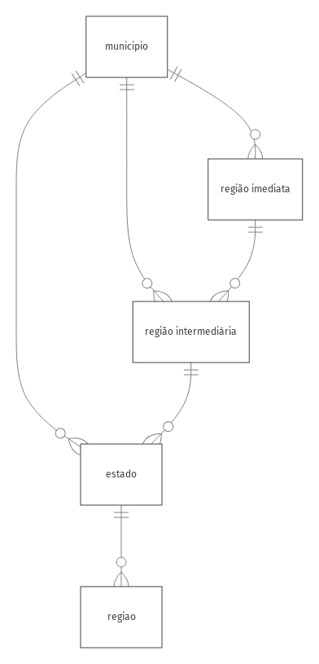
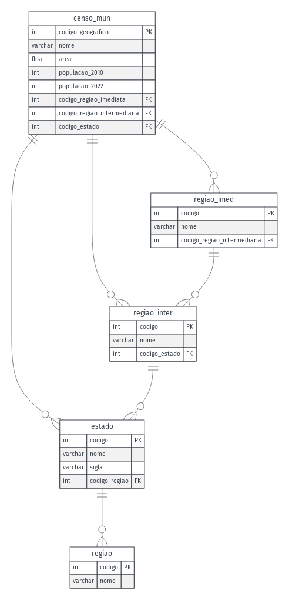
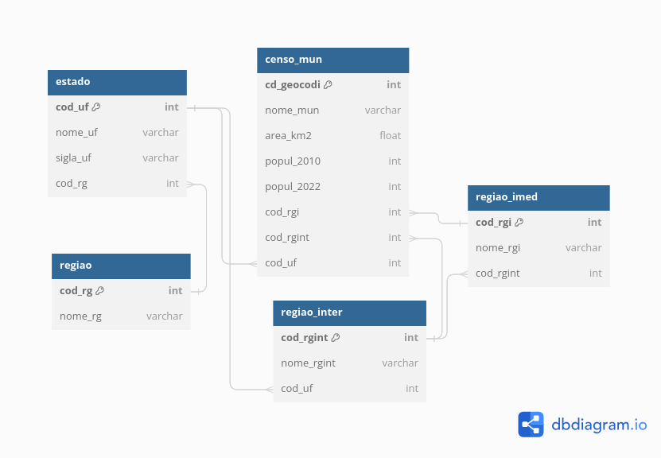

---
jupytext:
  formats: md:myst
  text_representation:
    extension: .md
    format_name: myst
    format_version: 0.13
    jupytext_version: 1.16.0
kernelspec:
  display_name: Python 3
  language: python
  name: python3
---


# 2. INTRODUÇÃO AO SQL (STRUCTURED QUERY LANGUAGE)

[Abrir no Google Colab](https://colab.research.google.com/https://github.com/Alexandrogschafer/Spatial-Database/blob/gh-pages/notebooks/capitulo2.ipynb)

SQL, que significa "Structured Query Language", é a linguagem de programação padrão usada para comunicar e manipular bancos de dados relacionais. Desde sua criação, tem sido uma ferramenta indispensável para os profissionais de banco de dados, permitindo-lhes criar, modificar, gerenciar e consultar dados de forma eficaz. O poder do SQL reside em sua capacidade de lidar com conjuntos de dados grandes e complexos com comandos concisos e expressões bem definidas. 

Através de suas instruções de consulta, é possível não só realizar operações básicas de CRUD (Criar, Ler, Atualizar e Deletar dados), mas também executar tarefas avançadas como transações de dados, manipulação de esquemas de banco de dados e controle de acesso.

Diferentemente de outras linguagens de programação, como Java ou Python, que são linguagens de propósito geral, o SQL é especializado para a gestão de dados dentro de um SGBD relacional. Enquanto linguagens de propósito geral podem ser utilizadas para desenvolver aplicações diversas — de jogos a algoritmos de aprendizado de máquina —, o SQL é projetado especificamente para trabalhar com dados relacionais. Ele utiliza uma abordagem declarativa: o usuário especifica o que deseja fazer sem descrever todos os passos necessários para realizar a tarefa. Por exemplo, ao invés de iterar sobre linhas de dados como faria em uma linguagem de programação convencional, um usuário SQL simplesmente declara que deseja selecionar dados de uma tabela sob certas condições, e o sistema de gerenciamento do banco de dados trata de encontrar a forma mais eficiente de executar essa requisição.

O SQL distingue-se ainda por ser fortemente baseado em álgebra relacional e cálculo de tuplas, fundamentos teóricos que garantem não só a sua robustez, mas também a sua adaptabilidade e durabilidade ao longo do tempo. Esta especialização faz do SQL a escolha ideal para situações em que a manipulação de dados é primordial, garantindo que os usuários possam realizar consultas complexas e manter a integridade dos dados com um mínimo de instruções. 

A despeito das inúmeras extensões e variações que surgiram para atender a necessidades específicas, o SQL mantém uma sintaxe e funcionalidade consistentes que facilitam a portabilidade entre diferentes sistemas de banco de dados e a aprendizagem por novos usuários, assegurando o seu lugar como a linguagem dominante no campo do gerenciamento de dados relacionais.


## 2.1 Breve histórico do SQL

A linguagem SQL (Structured Query Language) tem uma história de desenvolvimento relativamente longa, desde suas origens até seu papel central nos sistemas de gerenciamento de banco de dados modernos.

**Década de 1960 - Surgimento dos Bancos de Dados:**
- Nas décadas de 1950 e 1960, os sistemas de gerenciamento de banco de dados começaram a ser desenvolvidos em resposta à necessidade crescente de armazenar e manipular grandes volumes de dados.
- O modelo relacional de banco de dados, proposto por Edgar F. Codd em seu artigo "A Relational Model of Data for Large Shared Data Banks" em 1970, estabeleceu os fundamentos teóricos para a organização e manipulação de dados.

**Década de 1970 - Desenvolvimento do SQL:**
- O IBM Research Laboratory desenvolveu uma linguagem chamada SEQUEL (Structured English QUEry Language) nos anos 1970, que mais tarde foi renomeada para SQL (Structured Query Language).
- O SQL foi desenvolvido como uma linguagem padrão para consultas e manipulação de bancos de dados relacionais, baseada nos princípios do modelo relacional de dados de Codd.
- A IBM lançou o primeiro produto comercial de banco de dados a usar SQL, chamado System R, em 1978.

**Década de 1980 - Padrão ANSI SQL:**
- Durante os anos 1980, várias implementações comerciais de bancos de dados relacionais surgiram, cada uma com sua própria versão do SQL.
- Em 1986, o ANSI (American National Standards Institute) estabeleceu um comitê para desenvolver um padrão para a linguagem SQL, a fim de promover a interoperabilidade entre os sistemas de banco de dados.
- O padrão ANSI SQL-86 foi o primeiro a ser oficializado, seguido pelo ANSI SQL-89.

**Década de 1990 - Expansão e complexidade:**
- Durante os anos 1990, o SQL se tornou a linguagem padrão para interação com bancos de dados relacionais em uma ampla variedade de aplicativos e sistemas.
- Novas versões do padrão ANSI SQL foram lançadas, incluindo SQL-92, SQL:1999 e SQL:2003, introduzindo novos recursos, como suporte a tipos de dados avançados, gatilhos (triggers), procedimentos armazenados e muito mais.

**Década de 2000 até o presente - Evolução contínua:**
- Desde o início do século XXI, o SQL continuou a evoluir para atender às demandas crescentes de aplicativos e sistemas modernos.
- Novas funcionalidades foram adicionadas às versões mais recentes do padrão SQL, como suporte a XML, SQL:2008, SQL:2011, SQL:2016 e SQL:2019.
- Além do padrão ANSI SQL, várias implementações proprietárias de SQL foram desenvolvidas por empresas de tecnologia, como Microsoft SQL Server, Oracle Database, MySQL, PostgreSQL, entre outros, cada uma com suas próprias extensões e melhorias.


## 2.2 Visão geral do Banco de Dados de exemplo

Antes de avançarmos no estudo da linguagem SQL, torna-se imperativo estabelecer uma base comum na qual aplicaremos os conceitos que serão discutidos ao longo deste capítulo. Para isso, apresentaremos um banco de dados de exemplo, concebido não apenas para ilustrar os conceitos teóricos de SQL, mas também para fornecer uma experiência prática através de exemplos aplicáveis. Este banco de dados será nosso laboratório, onde exploraremos desde consultas simples até operações complexas de manipulação e controle de dados.

O processo de desenvolvimento de um banco de dados é tipicamente conduzido através de várias etapas distintas. Neste contexto, delinearemos a evolução do nosso projeto de banco de dados em quatro fases fundamentais: Análise de Requisitos e Consultas; Modelagem Conceitual; Design Lógico; e Implementação Física.

- **Requisitos de consulta e análise:** Esta seção inicial define as capacidades analíticas e as consultas específicas que o banco de dados deve suportar. Esses requisitos orientarão as fases subsequentes de modelagem, assegurando que o banco de dados possa responder a perguntas críticas sobre população, crescimento e distribuição em diferentes níveis geográficos, desde municípios até regiões.

- **Modelo conceitual:** Esta fase se concentra na identificação das entidades-chave, como municípios, regiões imediatas, regiões intermediárias, estados e regiões, e nas relações entre elas, sem se ater aos detalhes técnicos de implementação. O objetivo é estabelecer uma visão clara e abstrata da estrutura de dados, facilitando a compreensão dos relacionamentos e fluxos de informação.

- **Projeto lógico:** Após a definição do modelo conceitual, o projeto lógico detalha a estrutura do banco de dados em termos de tabelas, colunas, chaves primárias e estrangeiras, e relações. Esta etapa traduz o modelo conceitual em um esquema lógico que serve como um plano para a implementação física, considerando as características específicas do SGBD escolhido. O escopo deste projeto lógico abrange a organização necessária para armazenar e gerenciar os dados demográficos, garantindo a integridade, a normalização e a eficiência na manipulação dos dados.

- **Projeto físico:** A fase final do desenvolvimento concentra-se na implementação do projeto lógico no SGBD selecionado (o PostgreSQL), definindo aspectos técnicos como tipos de dados e restrições.

Esta estrutura garante que o design e a implementação do banco de dados sejam direcionados pelas necessidades analíticas do projeto, proporcionando uma base sólida para o desenvolvimento de consultas complexas e relatórios analíticos detalhados.

É importante enfatizar que a finalidade do projeto do banco de dados aqui apresentado não é explorar exaustivamente a metodologia de desenvolvimento de bancos de dados. Portanto, a documentação fornecida aqui é intencionalmente concisa e simplificada. Em projetos de bancos de dados reais, o processo de desenvolvimento é tipicamente mais intricado, abrangendo etapas adicionais e um nível de detalhamento mais profundo em cada fase.


### 2.2.1 Requisitos de consulta e análise

O objetivo principal deste banco de dados é facilitar a análise dos dados demográficos coletados pelo Instituto Brasileiro de Geografia e Estatística (IBGE), permitindo a exploração de padrões populacionais e tendências de crescimento ou declínio ao longo do tempo em diferentes níveis geográficos. Destinado especificamente para acadêmicos e pesquisadores atuantes nas áreas de demografia, geografia e disciplinas correlatas, o banco de dados é projetado para apoiar suas investigações e publicações científicas. Esses usuários, oriundos do meio acadêmico, necessitam de acesso a dados detalhados e confiáveis para fundamentar análises complexas, realizar estudos comparativos e embasar suas contribuições teóricas e práticas para o conhecimento nas suas respectivas áreas de especialização.

As funcionalidades e capacidades do banco de dados estão orientadas para suportar uma variedade de consultas analíticas. As seguintes questões ilustram exemplos de análises que nosso banco de dados deve suportar, refletindo as necessidades de seus usuários:

**Análise demográfica:**
- Determinação da população total do Brasil, bem como de cada região, estado, região intermediária, região imediata, e município nos anos de 2010 e 2022.
- Identificação das regiões e municípios com o maior crescimento populacional entre 2010 e 2022.
- Análise das áreas que experimentaram redução populacional no mesmo período.

**Análise temporal e comparativa:**
- Como a distribuição populacional evoluiu ao longo do tempo em diferentes granularidades espaciais no Brasil?
- Comparação das taxas de crescimento ou declínio populacional entre 2010 e 2022 em diferentes granularidades espaciais.

**Análises específicas de localidade:**
- Cálculo da população total das capitais dos estados brasileiros em 2022.
- Exploração de como as regiões imediatas contribuem para a população total de um estado específico.
- Determinação das regiões imediatas com a maior e a menor população dentro de uma região intermediária específica.


#### 2.2.1.1 Modelo conceitual

Um modelo conceitual de banco de dados é uma representação abstrata e de alto nível de como os dados estão organizados e interagem entre si dentro de um sistema de banco de dados. Ao contrário dos modelos físicos, que detalham como os dados são armazenados no hardware, ou dos modelos lógicos, que definem estruturas de dados específicas como tabelas e colunas em um sistema de gerenciamento de banco de dados, o modelo conceitual foca na estrutura geral dos dados e nas relações entre eles, ignorando detalhes técnicos.

O modelo conceitual de nosso banco de dados está representado no diagrama a seguir:




O modelo conceitual de nosso banco de dados apresenta uma hierarquia clara e estruturada que vai do nível municipal até o regional, permitindo uma análise detalhada e abrangente da população e da organização territorial do Brasil. Aqui está um resumo do modelo conceitual:

- **Município:** Representa a unidade base para a organização dos dados demográficos. Cada município é único e é identificado por um código geográfico específico, servindo como ponto de partida para compreender a estrutura administrativa e populacional no contexto geográfico do Brasil. Informações demográficas e geográficas são associadas a cada município.

- **Região Imediata:** Cada município está diretamente vinculado a uma região imediata. Estas regiões representam agrupamentos de municípios que compartilham proximidade geográfica e características socioeconômicas similares. A região imediata reflete uma área de influência próxima, onde há maior interação entre os municípios para serviços básicos e atividades econômicas, auxiliando na compreensão das dinâmicas locais.

- **Região Intermediária:** Abrange um conjunto mais amplo de municípios, incluindo várias regiões imediatas, e indica uma esfera de influência significativa que pode abranger grandes áreas geográficas e econômicas dentro de um estado. Este nível torna possível a realização de análises regionais e o planejamento de infraestrutura e serviços para uma população maior.

- **Estado:** Cada município está ligado a um estado, que é parte integral da federação brasileira. Os estados são componentes fundamentais para a análise demográfica e a administração territorial.

- **Região:** Os estados são agrupados em regiões, as maiores divisões administrativas do Brasil, facilitando análises demográficas em larga escala e o entendimento da distribuição populacional e organização territorial em um nível nacional.

Este modelo conceitual fornece a base para compreender as relações e hierarquias dentro do banco de dados, enfatizando a importância de cada nível administrativo e geográfico na análise demográfica do Brasil.


#### 2.2.1.2 Projeto lógico

O projeto lógico de um banco de dados envolve a modelagem dos dados de forma abstrata, sem considerar os detalhes específicos do sistema de gerenciamento de banco de dados (SGBD) que será utilizado. Esta fase foca na estruturação dos dados, definindo entidades, atributos, chaves primárias, chaves estrangeiras, e as relações entre as entidades. O objetivo é criar um modelo que represente os requisitos de informação do sistema de forma precisa.

O diagrama Entidade-Relacionamento (E-R) é uma ferramenta fundamental nesta fase, oferecendo uma representação visual das entidades envolvidas no banco de dados, seus atributos e as relações entre elas. Este modelo serve como uma ponte entre os requisitos de informação definidos na fase de análise e o projeto físico do banco de dados, facilitando a compreensão das estruturas de dados que serão implementadas.

Abaixo, apresentamos o diagrama E-R completo, com as entidades e seus respectivos atributos:



Este diagrama inclui as seguintes entidades principais (a serem detalhadas com atributos e relações no diagrama real):

- **Município:** Representa a unidade básica de análise demográfica, com atributos como código geográfico, nome, população e dados geográficos.
- **Região Imediata e Intermediária:** Agrupa municípios com base em características geográficas e socioeconômicas, contendo atributos como código, nome e a relação com municípios pertencentes.
- **Estado:** Incorpora informações sobre os estados brasileiros, incluindo atributos como código, nome e a relação com suas regiões imediatas e intermediárias.
- **Região:** Descreve as maiores divisões administrativas do Brasil, com atributos incluindo código, nome e os estados membros.

Os relacionamentos estabelecidos são:

- **censo_mun ↔ regiao_imed:** Um município pertence a uma região imediata.
- **censo_mun ↔ regiao_inter:** Um município pertence a uma região intermediária.
- **censo_mun ↔ estado:** Um município pertence a um estado.
- **regiao_imed ↔ regiao_inter:** Uma região imediata pertence a uma região intermediária.
- **regiao_inter ↔ estado:** Uma região intermediária pertence a um estado.
- **estado ↔ regiao:** Um estado pertence a uma região.


Na figura abaixo, apresentamos o diagrama lógico do banco de dados construído na ferramenta dbdiagram.io (https://dbdiagram.io/home). 



Este diagrama representa a estrutura hierárquica e as relações entre municípios, regiões imediatas e intermediárias, estados e regiões para o nosso banco de dados. Segue abaixo a descrição detalhada da estrutura do banco de dados:


**Tabela `censo_mun`**
- `cd_geocodi` INT [PK]: Código geográfico do município, sendo a chave primária.
- `nome_mun` VARCHAR: Nome do município.
- `area_km2` FLOAT: Área do município em quilômetros quadrados.
- `popul_2010` INT: População do município em 2010.
- `popul_2022` INT: População do município em 2022.
- `cod_rgi` INT [FK]: Código da região imediata à qual o município pertence, chave estrangeira.
- `cod_rgint` INT [FK]: Código da região intermediária à qual o município pertence, chave estrangeira.
- `cod_uf` INT [FK]: Código do estado ao qual o município pertence, chave estrangeira.

**Tabela `regiao_imed`**
- `cod_rgi` INT [PK]: Código identificador da região imediata, sendo a chave primária.
- `nome_rgi` VARCHAR: Nome da região imediata.
- `cod_rgint` INT [FK]: Código da região intermediária à qual a região imediata pertence, chave estrangeira.

**Tabela `regiao_inter`**
- `cod_rgint` INT [PK]: Código identificador da região intermediária, sendo a chave primária.
- `nome_rgint` VARCHAR: Nome da região intermediária.
- `cod_uf` INT [FK]: Código do estado ao qual a região intermediária pertence, chave estrangeira.

**Tabela `estado`**
- `cod_uf` INT [PK]: Código identificador do estado, sendo a chave primária.
- `nome_uf` VARCHAR: Nome do estado.
- `sigla_uf` VARCHAR: Sigla do estado.
- `cod_rg` INT [FK]: Código da região à qual o estado pertence, chave estrangeira.

**Tabela `regiao`**
- `cod_rg` INT [PK]: Código identificador da região, sendo a chave primária.
- `nome_rg` VARCHAR: Nome da região.


**Detalhes técnicos do projeto lógico**

*Relacionamentos*

- Cada registro em `censo_mun` está vinculado a uma única `regiao_imed`, `regiao_inter`, e `estado` através de chaves estrangeiras (`FK`), refletindo a estrutura geográfica e administrativa do Brasil. Esta configuração assegura a representação precisa das hierarquias territoriais e administrativas.
  - `regiao_imed` está ligada a `regiao_inter`, e estas estão associadas a `estado`, que por sua vez é vinculado a `regiao`, demonstrando a hierarquia administrativa e territorial do país. Esses relacionamentos permitem análises detalhadas e multifacetadas baseadas em diversos níveis geográficos.

*Chaves e índices*
- As chaves primárias (`PK`) são definidas para garantir a identificação única de registros dentro de cada tabela. As chaves estrangeiras (`FK`) estabelecem relações entre as tabelas, assegurando a integridade referencial e permitindo consultas relacionais eficientes.
- Índices podem ser utilizados nas chaves primárias e em colunas frequentemente acessadas para melhorar o desempenho das consultas.

*Tipos de dados*
- Utilizam-se os tipos de dados `INT` para números inteiros, `VARCHAR` para textos, e `FLOAT` para números com ponto flutuante. Essa escolha de tipos de dados visa otimizar o armazenamento e o acesso aos dados, garantindo a precisão e eficácia nas consultas e análises.

*Normalização*
- O design do banco de dados segue os princípios de normalização até a Terceira Forma Normal (3NF). Este processo minimiza redundâncias, evita anomalias de dados e assegura a integridade dos dados, contribuindo para um armazenamento eficiente e para a facilidade de manutenção do banco de dados.

Essas diretrizes de projeto e estruturação do banco de dados garantem não apenas a eficiência e a robustez no armazenamento e na recuperação de dados, mas também a flexibilidade para futuras expansões e ajustes conforme as necessidades de análise evoluem.


#### 2.2.1.3 Projeto físico

O projeto físico de um banco de dados é uma etapa na modelagem de banco de dados onde se define como o modelo lógico será implementado dentro de um sistema de gerenciamento de banco de dados específico (SGBD). Para o curso, escolhemos o SGBD PostgreSQL, um dos sistemas de gerenciamento de banco de dados relacional mais avançados e de código aberto disponíveis (https://www.postgresql.org/).

A implementação física do nosso banco de dados no PostgreSQL é realizada através dos seguintes comandos em linguagem SQL:

```sql
CREATE TABLE "censo_mun" (
  "cd_geocodi" int PRIMARY KEY,
  "nome_mun" varchar,
  "area_km2" float,
  "popul_2010" int,
  "popul_2022" int,
  "cod_rgi" int,
  "cod_rgint" int,
  "cod_uf" int
);

CREATE TABLE "regiao_imed" (
  "cod_rgi" int PRIMARY KEY,
  "nome_rgi" varchar,
  "cod_rgint" int
);

CREATE TABLE "regiao_inter" (
  "cod_rgint" int PRIMARY KEY,
  "nome_rgint" varchar,
  "cod_uf" int
);

CREATE TABLE "estado" (
  "cod_uf" int PRIMARY KEY,
  "nome_uf" varchar,
  "sigla_uf" varchar,
  "cod_rg" int
);

CREATE TABLE "regiao" (
  "cod_rg" int PRIMARY KEY,
  "nome_rg" varchar
);

ALTER TABLE "censo_mun" ADD FOREIGN KEY ("cod_rgi") REFERENCES "regiao_imed" ("cod_rgi");
ALTER TABLE "censo_mun" ADD FOREIGN KEY ("cod_rgint") REFERENCES "regiao_inter" ("cod_rgint");
ALTER TABLE "censo_mun" ADD FOREIGN KEY ("cod_uf") REFERENCES "estado" ("cod_uf");
ALTER TABLE "regiao_imed" ADD FOREIGN KEY ("cod_rgint") REFERENCES "regiao_inter" ("cod_rgint");
ALTER TABLE "regiao_inter" ADD FOREIGN KEY ("cod_uf") REFERENCES "estado" ("cod_uf");
ALTER TABLE "estado" ADD FOREIGN KEY ("cod_rg") REFERENCES "regiao" ("cod_rg");
```

Estes comandos SQL definem a estrutura das tabelas do banco de dados, incluindo colunas, tipos de dados e chaves primárias (PRIMARY KEY). Além disso, os comandos ALTER TABLE são usados para estabelecer as relações entre as tabelas por meio de chaves estrangeiras (FOREIGN KEY), assegurando a integridade referencial do banco de dados. A escolha do PostgreSQL permite aproveitar suas funcionalidades e sua conformidade com os padrões SQL, facilitando a implementação e a manutenção do banco de dados.


## 2.3 Configuração do ambiente de desenvolvimento e fundamentos de conexão com PostgreSQL utilizando Python

Essa seção aborda a preparação do ambiente necessário para realizar as atividades práticas de nosso curso, detalhando o processo passo a passo para configurar um ambiente de desenvolvimento para trabalhar com bancos de dados SQL, especificamente utilizando o PostgreSQL, diretamente no ambiente do Google Colaboratory.

A interação com um Sistema de Gerenciamento de Banco de Dados Relacional (SGBD Relacional) pode variar em complexidade, dependendo da tarefa em questão e do nível de experiência do usuário. Existem diversas interfaces e ferramentas projetadas para facilitar essa interação, cada uma adequada a diferentes necessidades e níveis de habilidade.

**Interfaces de Linha de Comando (CLI)**

As interfaces de linha de comando (CLI) são ferramentas que permitem aos usuários interagir com o banco de dados digitando comandos SQL diretamente em um prompt de comando. Essas interfaces são poderosas, mas exigem um conhecimento sólido da sintaxe SQL e dos comandos específicos do SGBD. Elas são ideais para usuários experientes que buscam uma abordagem rápida e direta.

**Interfaces Gráficas de Usuário (GUIs)**

Para uma experiência de usuário mais intuitiva, as interfaces gráficas de usuário (GUIs) permitem a interação com o banco de dados através de elementos visuais como menus, botões e formulários. Ferramentas GUI facilitam a gestão de bancos de dados, tornando-a mais acessível a usuários com menos familiaridade com SQL. Ferramentas como PGAdmin, PostgreSQL Studio, DBeaver e DataGrip permitem realizar diversas tarefas de banco de dados de forma visual.

**Bibliotecas de programação específicas**

Desenvolvedores podem utilizar bibliotecas de programação específicas para integrar funcionalidades de bancos de dados em suas aplicações. Essas bibliotecas, disponíveis para várias linguagens de programação, facilitam a execução de consultas SQL, manipulação de dados e gerenciamento de conexões de banco de dados através de chamadas de função na linguagem escolhida, abstraindo a necessidade de interação direta com a sintaxe SQL.


**Integração de Python e PostgreSQL no Google Colab: Uma abordagem prática para o aprendizado de SQL**

No contexto do nosso curso, utilizaremos o Python como a principal ferramenta para interagir com o SGBD PostgreSQL, em conjunto com o ambiente hospedado do Google Colab. 

O Google Colab destaca-se por ser um ambiente de desenvolvimento integrado (IDE) baseado em navegador, que simplifica o processo de aprendizado ao eliminar a necessidade de configurações complexas ou instalações de software. Isso permite aos estudantes focar exclusivamente no aprendizado da linguagem SQL e na interação com o PostgreSQL, oferecendo uma experiência de aprendizado direta e sem interrupções.

A execução de código Python em nuvem, uma das funcionalidades centrais do Google Colab, garante que todos os alunos tenham acesso a recursos computacionais consistentes e confiáveis, independentemente das especificações de seus dispositivos locais. Isso democratiza o acesso às ferramentas necessárias para o estudo de SQL, permitindo que estudantes de diversos contextos tenham igualdade de oportunidades de aprendizado.

A integração do PostgreSQL nos servidores do Google padroniza o acesso ao banco de dados, garantindo uma experiência uniforme de ensino e aprendizagem. Com todos os alunos trabalhando com a mesma configuração de banco de dados, é promovida uma experiência equitativa, onde cada um tem acesso às mesmas ferramentas e recursos.

**Ferramentas para a interação com PostgreSQL**

A biblioteca `psycopg2` é uma ferramenta essencial para conectar Python ao PostgreSQL, permitindo a execução de comandos SQL diretamente a partir de scripts Python. Sua ampla utilização em aplicações que requerem interação com bancos de dados PostgreSQL a torna uma escolha confiável para o desenvolvimento e a educação, facilitando uma interface completa para consultas, atualizações e manipulação de dados.

Paralelamente, a extensão `ipython-sql` enriquece o IPython ao adicionar capacidades de execução de comandos SQL diretamente de células em notebooks IPython. Esta funcionalidade torna a escrita e execução de comandos SQL uma tarefa interativa, simplificando o processo de aprendizado e experimentação com a linguagem SQL.

Juntas, as bibliotecas `psycopg2` e `ipython-sql` aprimoram significativamente a interação com o PostgreSQL, tornando a exploração das capacidades do SQL dentro de um ambiente Python mais acessível e intuitiva. Essas ferramentas oferecem uma base sólida tanto para desenvolvedores quanto para educadores, facilitando o ensino e o aprendizado de SQL de forma prática e eficaz.


**Etapa 1: Configurando PostgreSQL no Google Colab**

Neste segmento, detalhamos o processo de instalação e configuração do PostgreSQL no ambiente Google Colab, garantindo que você tenha um sistema de banco de dados operacional para as atividades práticas do curso.

Instalação do PostgreSQL

Para começar, é necessário instalar o PostgreSQL juntamente com seus componentes adicionais diretamente no Google Colab. Execute o seguinte comando no notebook para instalar o PostgreSQL:

```{code-cell} python
# !apt-get install -y postgresql postgresql-contrib
```


Este comando instala a versão mais recente do PostgreSQL disponível nos repositórios do Ubuntu, que o Google Colab utiliza, além de vários módulos adicionais que podem ser úteis.

Inicializando o serviço PostgreSQL

Com o PostgreSQL instalado, o próximo passo é iniciar o serviço do banco de dados para que ele fique operacional e pronto para receber conexões. Use o comando a seguir para iniciar o PostgreSQL:

```{code-cell} python
#!service postgresql start
```

Este comando ativa o serviço do PostgreSQL, preparando o ambiente para a criação de bancos de dados e a execução de comandos SQL.


Configuração do usuário

Por questões de segurança, é aconselhável alterar a senha do usuário padrão `postgres`. Escolha uma senha forte e utilize o comando abaixo para atualizá-la:

```{code-cell} python
# !sudo -u postgres psql -c "ALTER USER postgres PASSWORD 'curso_geo';"
```

Substitua `'curso_geo'` pela senha que desejar. Este passo é fundamental para proteger o seu banco de dados contra acessos não autorizados.

Após completar essas etapas, o PostgreSQL estará configurado e pronto para uso no Google Colab, permitindo que você prossiga com as atividades práticas de manipulação de bancos de dados SQL.


**Etapa 2. Criação do Banco de Dados e conexão**

Remova o banco de dados `bd_censo_ibge` se ele já existir e crie um novo para evitar conflitos.

```{code-cell} python
#!sudo -u postgres psql -c 'DROP DATABASE IF EXISTS bd_censo_ibge;'
#!sudo -u postgres psql -c 'CREATE DATABASE bd_censo_ibge;'
```


Defina as credenciais como variáveis no seu script para facilitar a modificação e o gerenciamento posteriormente.

```{code-cell} python
dbname = 'bd_censo_ibge'  # Nome do banco de dados
user = 'postgres'         # Nome do usuário
password = 'curso_geo'    # Senha definida anteriormente
host = 'localhost'        # Endereço do host
```

*Conexão ao Banco de Dados:*

Instale a biblioteca `psycopg2`, que permite a conexão e manipulação do PostgreSQL com Python. Em seguida, estabeleça a conexão com o banco de dados.

```{code-cell} python
#!pip install psycopg2
```

```{code-cell} python
import psycopg2

try:
    conn = psycopg2.connect(dbname=dbname, user=user, host=host, password=password)
    cur = conn.cursor()
    print("Conectado ao banco de dados com sucesso!")
except Exception as e:
    print("Erro ao conectar ao banco de dados: ", e)
```

**Apagando e recriando um Banco de Dados com psycopg2**

Em nosso exemplo prático não é necessário apagar o Banco de Dados. Inserimos estas instruções para o caso de você ter problemas que não consiga resolver. Neste caso, pode ser necessário apagar o Banco de Dados atual e criar um novo. Se não é este o seu caso, pode ir direto para a Etapa 3.

- Configurando o nível de isolamento para 'autocommit':

Antes de apagar o banco de dados, é necessário configurar o nível de isolamento da conexão para 'autocommit'. Isso permite executar comandos que alteram o estado do banco de dados, como `DROP DATABASE`, fora de uma transação.

```
import psycopg2
from psycopg2.extensions import ISOLATION_LEVEL_AUTOCOMMIT

# Configuração inicial do nível de isolamento
conn.set_isolation_level(psycopg2.extensions.ISOLATION_LEVEL_AUTOCOMMIT)
```

- Conectar ao Banco de Dados padrão:

Para apagar um banco de dados, você deve se conectar ao banco de dados padrão (`postgres`, por exemplo), pois não é possível apagar o banco de dados atualmente em uso.

```
conn = psycopg2.connect(dbname='postgres', user=user, password=password, host=host)
conn.set_isolation_level(ISOLATION_LEVEL_AUTOCOMMIT)
```

- Desconectar conexões ativas

Antes de apagar o banco de dados, é necessário desconectar todas as conexões ativas para evitar conflitos.

```
cur = conn.cursor()
cur.execute("""SELECT pg_terminate_backend(pg_stat_activity.pid)
               FROM pg_stat_activity
               WHERE pg_stat_activity.datname = 'bd_censo_ibge';""")
```

- Apagar o Banco de Dados

Com as conexões ativas desconectadas, você pode apagar o banco de dados.

```
cur.execute('DROP DATABASE bd_censo_ibge;')
```

- Verificar e recriar o Banco de Dados

Após apagar o banco de dados, você pode tentar reconectá-lo para verificar se foi apagado corretamente. Isso deve resultar em um erro, indicando que o banco de dados não existe.

```
try:
    conn = psycopg2.connect(dbname='bd_censo_ibge', user=user, host=host, password=password)
except Exception as e:
    print("Erro ao conectar ao banco de dados: ", e)

cur.close()
conn.close()
```

Finalmente, recrie o banco de dados e verifique a conexão.

```
!sudo -u postgres psql -c 'DROP DATABASE IF EXISTS bd_censo_ibge;'
!sudo -u postgres psql -c 'CREATE DATABASE bd_censo_ibge;'

try:
    conn = psycopg2.connect(dbname=dbname, user=user, host=host, password=password)
    print("Conectado ao banco de dados com sucesso!")
except Exception as e:
    print("Erro ao conectar ao banco de dados: ", e)
```


Essa sequência de comandos e instruções detalha o processo para remover um banco de dados existente (se necessário), definir credenciais, conectar ao PostgreSQL via Python no Google Colab, e as etapas para apagar e recriar um banco de dados, configurando corretamente o nível de isolamento para permitir a execução de comandos que alteram o estado do banco de dados fora de uma transação.


**Etapa 3: Conectando-se a PostgreSQL com ipython-sql no Jupyter Notebook**

Para realizar consultas SQL diretamente de um Jupyter Notebook, você pode usar a extensão `ipython-sql`. Primeiro, é necessário instalar a extensão, configurar a string de conexão e, em seguida, carregar a extensão para usar com o seu banco de dados PostgreSQL.

- Instalar da extensão ipython-sql

A instalação é feita através do pip, o gerenciador de pacotes Python. Execute o seguinte comando no Jupyter Notebook para instalar a `ipython-sql`.

```{code-cell} python
# !pip install ipython-sql
```

- Configurar a string de conexão

A string de conexão é uma forma de informar ao `ipython-sql` como se conectar ao seu banco de dados PostgreSQL. Ela contém informações como usuário, senha, host e o nome do banco de dados.

```{code-cell} python

connection_string = f"postgresql://{user}:{password}@{host}/{dbname}"
```

- Carregar a extensão ipython-sql

Com a string de conexão configurada, carregue a extensão `ipython-sql` para permitir a execução de comandos SQL diretamente nas células do Jupyter Notebook.

```{code-cell} python
%load_ext sql
%sql $connection_string
```

- Executar uma consulta SQL

Para testar a conexão e a configuração, você pode executar uma consulta SQL simples, como selecionar a versão do PostgreSQL em uso.

```{code-cell} python
%sql SELECT version();
```


**Etapa 4: Preparação e diagnóstico inicial do Banco de Dados**

Para obter uma compreensão abrangente e detalhada do estado atual do seu banco de dados antes de iniciar a criação de tabelas e inserção de dados, é recomendável realizar uma série de consultas prévias. Cada consulta tem seu propósito específico, ajudando você a entender a estrutura, as permissões, as configurações e o desempenho do seu banco de dados. Aqui está um guia unificado que inclui todas as consultas essenciais e suas explicações:

- Consultar esquemas existentes

**Objetivo:** Visualizar os esquemas disponíveis no banco de dados para entender sua estrutura organizacional.

```{code-cell} python
%%sql 
SELECT schema_name 
FROM information_schema.schemata;
```

- Listar tabelas no esquema 'public'

**Objetivo:** Verificar as tabelas existentes no esquema `public`, o esquema padrão para muitas operações.

```{code-cell} python
%%sql 
SELECT table_name 
FROM information_schema.tables 
WHERE table_schema = 'public';
```


- Verificar versão do Banco de Dados

**Objetivo:** Identificar a versão do banco de dados para garantir compatibilidade e suporte adequado.

```{code-cell} python
%%sql 
SELECT version();
```

- Verificar o espaço em disco

**Objetivo:** Avaliar o espaço em disco disponível, importante no contexto do planejamento de armazenamento e prevenção de problemas.

```{code-cell} python
%%sql 
SELECT pg_size_pretty(pg_database_size(current_database()));
```

- Verificar conexões ativas

**Objetivo:** Monitorar as conexões ativas para identificar atividades, desempenho e potenciais bloqueios.

```{code-cell} python
%%sql 
SELECT * 
FROM pg_stat_activity;
```

- Consultar Índices Existentes

**Objetivo:** Revisar índices já existentes no esquema `public` para otimizar a criação de novos índices e melhorar a eficiência das consultas.

```{code-cell} python
%%sql 
SELECT * 
FROM pg_indexes 
WHERE schemaname = 'public';
```

Ainda não temos nenhum índice definido em nosso banco de dados. Criaremos índices ao longo deste capítulo.


## 2.4 Categorias fundamentais da linguagem SQL: DDL, DML e DCL

A interação com um Sistema de Gerenciamento de Banco de Dados Relacional (SGBD Relacional) envolve vários passos e componentes, seguindo princípios gerais que permitem a armazenagem, a manipulação e a recuperação de dados. Essa interação geralmente ocorre em um ciclo contínuo de definição, manipulação e controle de dados. 

O primeiro passo na interação com um SGBD relacional é definir o esquema do banco de dados. Isso envolve especificar as estruturas que armazenarão os dados, conhecidas como tabelas, que são organizadas em colunas e linhas. Cada coluna em uma tabela representa um campo de dados (como nome, idade, endereço), enquanto cada linha representa um registro específico. Este processo de definição é realizado utilizando uma linguagem de definição de dados (DDL, Data Definition Language), que permite criar, modificar e remover tabelas e outros objetos do banco de dados.

Após a definição das estruturas de dados, o próximo passo é inserir e manipular os dados dentro dessas estruturas. Isso é feito através de uma linguagem de manipulação de dados (DML, Data Manipulation Language), que permite inserir, atualizar, deletar e consultar registros no banco de dados. 

A consulta de dados é uma parte fundamental da interação com um SGBD relacional. Usuários e aplicações realizam consultas para recuperar dados específicos com base em critérios de pesquisa. Isso é feito utilizando a cláusula SELECT da DML, que permite especificar exatamente quais dados deseja-se extrair do banco de dados, podendo filtrar, ordenar e agrupar os dados conforme necessário. As consultas podem ser simples, buscando dados de uma única tabela, ou complexas, envolvendo a junção de múltiplas tabelas e a aplicação de funções agregadas.

O controle de acesso e a gestão de transações são aspectos de grande relevância na interação com SGBDs relacionais. O controle de acesso é gerido por meio de uma linguagem de controle de dados (DCL, Data Control Language), que define quem pode acessar e manipular os dados. As transações, por outro lado, permitem que múltiplas operações de banco de dados sejam executadas como uma única unidade de trabalho, garantindo que todas as operações sejam concluídas com sucesso ou que nenhuma seja aplicada em caso de falha em uma das operações. 


### 2.4.1 Linguagem de definição de dados (Data Definition Language - DDL)

A linguagem de definição de dados é um subconjunto da linguagem SQL que lida com a definição e a modificação da estrutura de uma base de dados e dos objetos nela contidos, como tabelas, índices e restrições. Os comandos DDL mais comuns são CREATE, ALTER e DROP. 


**Comando `CREATE`**

O comando `CREATE` é utilizado para criar um novo objeto no banco de dados. Por exemplo, para criar uma tabela, você usaria a seguinte sintaxe:

```sql
-- Criação de Tabela
CREATE TABLE nome_tabela (
    coluna1 tipo_dado restrição,
    coluna2 tipo_dado restrição,
    ...
);
```

Cada coluna é definida com um nome, um tipo de dado, e opcionalmente, uma ou mais restrições (constraints).


- Criação da Tabela `censo_ibge`:
  
A seguir, temos a consulta para criar a tabela `censo_ibge`, que armazenará dados do censo do IBGE, incluindo informações municipais, população e codificações geográficas.

```{code-cell}
%%sql
CREATE TABLE "censo_mun" (
  "cd_geocodi" int PRIMARY KEY,
  "nome_mun" varchar,
  "area_km2" float,
  "popul_2010" int,
  "popul_2022" int,
  "cod_rgi" int,
  "cod_rgint" int,
  "cod_uf" int
);
```

- Verificação do Banco de Dados
Após a criação da tabela, é importante verificar a existência e a contagem das tabelas no banco de dados, garantindo que a operação foi bem-sucedida.

```{code-cell}
%%sql
SELECT COUNT(*) 
FROM information_schema.tables 
WHERE table_schema = 'public';
```

Para verificar se a tabela `censo_mun` foi criada no banco de dados:

```{code-cell}
%%sql
SELECT *
FROM information_schema.tables 
WHERE table_schema = 'public';
```

Para examinar a estrutura da tabela `censo_mun`

Vamos examinar a estrutura da tabela, incluindo nomes de colunas, tipos de dados e outras propriedades.

```{code-cell}
%%sql
SELECT column_name, data_type, is_nullable, column_default
FROM information_schema.columns
WHERE table_name = 'censo_mun';
```


- Criação das demais tabelas de nosso banco de dados

Finalmente, procedemos com a criação de tabelas adicionais que formarão a estrutura de suporte para os dados do censo, incluindo regiões imediatas, regiões intermediárias, estados e regiões. Essas tabelas são essenciais para representar a estrutura geográfica e administrativa dentro do banco de dados.

```{code-cell}
%%sql
CREATE TABLE "regiao_imed" (
  "cod_rgi" int PRIMARY KEY,
  "nome_rgi" varchar,
  "cod_rgint" int
);

CREATE TABLE "regiao_inter" (
  "cod_rgint" int PRIMARY KEY,
  "nome_rgint" varchar,
  "cod_uf" int
);

CREATE TABLE "estado" (
  "cod_uf" int PRIMARY KEY,
  "nome_uf" varchar,
  "sigla_uf" varchar,
  "cod_rg" int
);

CREATE TABLE "regiao" (
  "cod_rg" int PRIMARY KEY,
  "nome_rg" varchar
);
```


- Verificação das Tabelas no Banco de Dados

Após a criação dessas tabelas, é importante verificar se elas foram devidamente criadas e estão presentes no banco de dados. Para isso, utilize a seguinte consulta SQL:

```{code-cell}
%%sql
SELECT table_name 
FROM information_schema.tables 
WHERE table_schema = 'public';
```

Esta consulta listará todas as tabelas existentes no esquema `public` do banco de dados, permitindo que você confirme a presença das tabelas recém-criadas.


**Comando `ALTER`**

O comando `ALTER` é utilizado para modificar a estrutura de um objeto de banco de dados existente. Por exemplo, para adicionar uma coluna a uma tabela existente, você usaria a seguinte sintaxe:

```sql
ALTER TABLE nome_tabela
ADD nome_coluna tipo_dado restrição;
```

- Adicionando uma coluna à tabela

Para adicionar uma nova coluna à tabela `censo_mun`, especificamente a coluna `dens_pop` que armazenará dados sobre a densidade populacional de cada município com o tipo de dado `float`, utilize a seguinte instrução SQL:

```{code-cell}
%%sql
ALTER TABLE censo_mun
ADD COLUMN dens_pop float;
```

Para modificar uma coluna existente, alterando seu tipo de dado:

```sql
ALTER TABLE nome_tabela
ALTER COLUMN nome_coluna TYPE novo_tipo_dado;
```

Por exemplo, para mudar o tipo de dado da coluna `dens_pop` na tabela `censo_mun` para `numeric` com precisão específica:

```{code-cell}
%%sql
ALTER TABLE censo_mun
ALTER COLUMN dens_pop TYPE numeric(10, 2);
```


Para remover uma coluna:

```sql
ALTER TABLE nome_tabela
DROP COLUMN nome_coluna;
```

Para deletar a coluna `dens_pop` da tabela `censo_mun`:

```{code-cell}
%%sql
ALTER TABLE censo_mun
DROP COLUMN dens_pop;
```


Após qualquer operação `ALTER`, é importante verificar a estrutura atualizada da tabela para confirmar as alterações. Utilize a consulta SQL a seguir para examinar a estrutura da tabela `censo_mun`, incluindo nomes de colunas, tipos de dados e outras propriedades relevantes:

```{code-cell}
%%sql
SELECT column_name, data_type, is_nullable, column_default
FROM information_schema.columns
WHERE table_name = 'censo_mun';
```

Estas instruções permitem modificar a estrutura de tabelas de maneira dinâmica, adaptando-se às necessidades de armazenamento de dados e às mudanças nos requisitos de análise. Lembre-se sempre de verificar a estrutura da tabela após realizar alterações para assegurar que as modificações foram aplicadas corretamente.


- Usando Alter Table para estabelecer relações com chaves estrangeiras

Chaves estrangeiras são um conceito fundamental em sistemas de gerenciamento de banco de dados relacionais (SGBDR), atuando como um pilar essencial para manter a integridade dos dados e estabelecer relações entre diferentes tabelas. Uma chave estrangeira em uma tabela é um campo (ou conjunto de campos) que aponta para a chave primária de outra tabela. O principal objetivo de uma chave estrangeira é garantir a integridade referencial entre duas tabelas, assegurando que o relacionamento entre elas permaneça consistente e confiável.


Na linguagem SQL, o comando `ALTER TABLE` pode ser utilizado para adicionar uma restrição de chave estrangeira à tabela secundária, conforme o exemplo a seguir:

```sql
ALTER TABLE tabela_secundaria
ADD FOREIGN KEY (coluna_chave_estrangeira)
REFERENCES tabela_primaria(coluna_chave_primaria);
```

Este comando estabelece a relação entre as tabelas, indicando que a `coluna_chave_estrangeira` na `tabela_secundaria` é uma chave estrangeira que aponta para a `coluna_chave_primaria` na `tabela_primaria`.

Para adicionar as chaves estrangeiras às tabelas, de acordo com o modelo lógico:

```{code-cell}
%%sql
ALTER TABLE "censo_mun" ADD FOREIGN KEY ("cod_rgi") REFERENCES "regiao_imed" ("cod_rgi");
ALTER TABLE "censo_mun" ADD FOREIGN KEY ("cod_rgint") REFERENCES "regiao_inter" ("cod_rgint");
ALTER TABLE "ALTER TABLE "censo_mun" ADD FOREIGN KEY ("cod_rgint") REFERENCES "regiao_inter" ("cod_rgint");" ADD FOREIGN KEY ("cod_uf") REFERENCES "estado" ("cod_uf");
ALTER TABLE "regiao_imed" ADD FOREIGN KEY ("cod_rgint") REFERENCES "regiao_inter" ("cod_rgint");
ALTER TABLE "regiao_inter" ADD FOREIGN KEY ("cod_uf") REFERENCES "estado" ("cod_uf");
ALTER TABLE "estado" ADD FOREIGN KEY ("cod_rg") REFERENCES "regiao" ("cod_rg");
```

Estes comandos adicionam chaves estrangeiras às tabelas `censo_mun`, `regiao_imed`, `regiao_inter`, `estado` e `regiao`, estabelecendo relações "muitos para um" entre essas tabelas. Isso garante a integridade dos dados, assegurando que os valores nas colunas de chaves estrangeiras correspondam aos valores existentes nas colunas de chaves primárias das tabelas referenciadas.

Ao adicionar essas chaves estrangeiras, criamos um banco de dados mais estruturado e normalizado, facilitando a manutenção da consistência dos dados e permitindo consultas mais eficientes através das relações estabelecidas.


**Comando `DROP`**

O comando `DROP` é usado para remover objetos do banco de dados. Este comando deve ser usado com cuidado, pois remove o objeto e todos os dados associados de forma irreversível.


Para excluir uma tabela inteira, podemos fazer:

```sql
DROP TABLE nome_tabela;
```

Por exemplo, para deletar a tabela `censo_mun` completamente do banco de dados, utilizamos a seguinte instrução SQL:

```{code-cell}
%%sql
DROP TABLE censo_mun;
```

Esta instrução `DROP TABLE` remove a tabela `censo_mun` e todos os dados associados a ela de forma irreversível. Antes de executar este comando, é importante garantir que a tabela e os dados contidos nela não são mais necessários, ou que você possui um backup apropriado, pois a operação é permanente.


Após remover a tabela, é uma boa prática verificar se a operação foi bem-sucedida:

```{code-cell}
%%sql
SELECT EXISTS (
  SELECT FROM information_schema.tables 
  WHERE table_name = 'censo_mun'
);
```

Esta consulta retorna um valor booleano (`TRUE` ou `FALSE`), indicando se a tabela `censo_mun` ainda existe no banco de dados. Se o resultado for `FALSE`, a tabela foi apagada com sucesso.


Após a remoção, você pode recriar a tabela `censo_mun`:

```{code-cell}
%%sql
CREATE TABLE "censo_mun" (
  "cd_geocodi" int PRIMARY KEY,
  "nome_mun" varchar,
  "area_km2" float,
  "popul_2010" int,
  "popul_2022" int,
  "cod_rgi" int,
  "cod_rgint" int,
  "cod_uf" int
);
```


Após a recriação da tabela, é essencial redefinir as chaves estrangeiras:

```{code-cell}
%%sql
ALTER TABLE "censo_mun" ADD FOREIGN KEY ("cod_rgi") REFERENCES "regiao_imed" ("cod_rgi");
ALTER TABLE "censo_mun" ADD FOREIGN KEY ("cod_rgint") REFERENCES "regiao_inter" ("cod_rgint");
ALTER TABLE "censo_mun" ADD FOREIGN KEY ("cod_uf") REFERENCES "estado" ("cod_uf");
```

Estas instruções reestabelecem as relações de chave estrangeira para a tabela `censo_mun`, assegurando a integridade referencial e as relações corretas com as outras tabelas no banco de dados.


### 2.4.2 Linguagem de Manipulação de Dados (Data Manipulation Language - DML)

A Linguagem de manipulação de dados (DML) é um conjunto de linguagens de banco de dados usadas para recuperar, inserir, modificar e excluir dados em um banco de dados. Os principais comandos da DML são `SELECT`, `INSERT`, `UPDATE`, e `DELETE`, fundamentais para a manipulação de dados em bancos de dados relacionais e formando a base das operações de CRUD (Create, Read, Update, Delete).


**Comando SELECT**

O comando `SELECT` é usado para consultar e recuperar dados de uma ou mais tabelas. A sintaxe básica é:

```sql
SELECT coluna1, coluna2, ...
FROM nome_tabela
WHERE condição;
```

- `SELECT`: especifica as colunas que serão retornadas na consulta.
- `FROM`: indica a tabela de onde os dados serão recuperados.
- `WHERE`: filtra os dados de acordo com uma condição especificada (opcional).


**Comando INSERT**

O comando `INSERT` é usado para inserir novos dados em uma tabela. A sintaxe básica é:

```sql
INSERT INTO nome_tabela (coluna1, coluna2, coluna3, ...)
VALUES (valor1, valor2, valor3, ...);
```

- `INSERT INTO`: indica a tabela na qual os dados serão inseridos.
- `(column1, column2, ...)`: especifica as colunas que receberão os dados.
- `VALUES`: indica os dados que serão inseridos em cada coluna.

Inicialmente, vamos popular a tabela `regiao` com os dados referentes às regiões do Brasil:

```{code-cell}
%%sql
INSERT INTO regiao (cod_rg, nome_rg) VALUES
(1, 'Norte'),
(2, 'Nordeste'),
(3, 'Sudeste'),
(4, 'Sul'),
(5, 'Centro-Oeste');
```

Para verificar o conteúdo da tabela `regiao`:

```{code-cell}
%%sql
SELECT * FROM regiao;
```

Populando a tabela “estado” com os estados do Brasil:

```{code-cell}
%%sql
INSERT INTO estado (cod_uf, nome_uf, sigla_uf, cod_rg) VALUES
(11, 'Rondônia', 'RO', 1),
(12, 'Acre', 'AC', 1),
(13, 'Amazonas', 'AM', 1),
(14, 'Roraima', 'RR', 1),
(15, 'Pará', 'PA', 1),
(16, 'Amapá', 'AP', 1),
(17, 'Tocantins', 'TO', 1),
(21, 'Maranhão', 'MA', 2),
(22, 'Piauí', 'PI', 2),
(23, 'Ceará', 'CE', 2),
(24, 'Rio Grande do Norte', 'RN', 2),
(25, 'Paraíba', 'PB', 2),
(26, 'Pernambuco', 'PE', 2),
(27, 'Alagoas', 'AL', 2),
(28, 'Sergipe', 'SE', 2),
(29, 'Bahia', 'BA', 2),
(31, 'Minas Gerais', 'MG', 3),
(32, 'Espírito Santo', 'ES', 3),
(33, 'Rio de Janeiro', 'RJ', 3),
(35, 'São Paulo', 'SP', 3),
(41, 'Paraná', 'PR', 4),
(42, 'Santa Catarina', 'SC', 4),
(43, 'Rio Grande do Sul', 'RS', 4),
(50, 'Mato Grosso do Sul', 'MS', 5),
(51, 'Mato Grosso', 'MT', 5),
(52, 'Goiás', 'GO', 5),
(53, 'Distrito Federal', 'DF', 5);
```

Para verificar o conteúdo da tabela `estado`:

```{code-cell}
%%sql
SELECT * FROM estado;
```

Essas instruções de `INSERT` populam as tabelas `regiao` e `estado` com dados representativos das regiões e estados do Brasil, estabelecendo a base de dados para consultas e manipulações subsequentes.


- Inserindo dados nas tabelas regiao_inter, regiao_imed, e censo_mun

Quando se trabalha com grandes volumes de dados, como aqueles fornecidos pelo Instituto Brasileiro de Geografia e Estatística (IBGE), é essencial empregar métodos eficientes de manipulação e inserção de dados. As tabelas `regiao_inter`, `regiao_imed`, e `censo_mun` demandam a inserção de um volume significativo de informações detalhadas, tornando o uso direto de comandos `INSERT` via SQL impraticável para essa finalidade.

**Preparação dos Dados:**

Os dados organizados em tabelas Excel pelo IBGE podem ser acessados e manipulados eficientemente por meio da integração entre o Google Drive e a biblioteca Pandas do Python. Este processo envolve várias etapas, começando com o acesso aos arquivos no Google Drive e culminando com a inserção dos dados no banco de dados.


Para acessar os arquivos Excel armazenados no Google Drive a partir do Google Colab, use o seguinte código para montar o Drive:

```
from google.colab import drive
drive.mount('/content/drive')
```

Este comando estabelece uma conexão segura entre o Google Colab e o Google Drive, facilitando o acesso aos arquivos necessários.


**Carregamento dos dados do Excel em DataFrames do Pandas:**

Com os arquivos de dados acessíveis, podemos proceder à leitura e manipulação dos dados com Pandas. Aqui estão os comandos para carregar os dados das regiões intermediárias, regiões imediatas e dados populacionais dos municípios em DataFrames:

```{code-cell}
import pandas as pd

# Carregamento dos dados das regiões intermediárias
df_regiao_inter = pd.read_excel('~/bde_book_w/files_bde/regiao_intermediaria.xlsx')
print(df_regiao_inter.head())

# Carregamento dos dados das regiões imediatas
df_regiao_imed = pd.read_excel('~/bde_book_w/files_bde/regiao_imediata.xlsx')
print(df_regiao_imed.head())

# Carregamento dos dados populacionais dos municípios
df_censo = pd.read_excel('~/bde_book_w/files_bde/censo_municipios.xlsx')
print(df_censo.head())
```

**Verificação das Tabelas do Banco de Dados:**

Antes de inserir os dados processados nas tabelas do banco de dados, é prudente verificar seu conteúdo atual:

```{code-cell}
%%sql
-- Verificar regiao_inter
SELECT * FROM regiao_inter;
```

```{code-cell}
%%sql
-- Verificar regiao_imed
SELECT * FROM regiao_imed;
```

```{code-cell}
%%sql
-- Verificar censo_mun
SELECT * FROM censo_mun;
```

Estas consultas SQL permitem verificar se as tabelas do banco de dados estão prontas para receber os dados. Ao confirmar que as tabelas estão vazias ou preparadas para a inserção, podemos proceder com a importação dos dados processados.


**Inserindo dados nas tabelas regiao_inter, regiao_imed, e censo_mun:**

Nesta etapa, utilizaremos o método `to_sql` da Pandas para inserir os dados dos DataFrames diretamente nas tabelas correspondentes. Este método não só agiliza o processo de inserção de dados como também assegura que eles sejam devidamente organizados e integrados ao sistema de banco de dados, facilitando análises e consultas futuras.


*Exemplo de Inserção de Dados com Pandas e SQLAlchemy:*


Para inserir os dados do DataFrame `df_regiao_inter` na tabela `regiao_inter` do banco de dados, utilizamos o seguinte procedimento:

```{code-cell}
from sqlalchemy import create_engine

dbname = 'bd_censo_ibge'  # Nome do banco de dados
user = 'postgres'         # Nome do usuário
password = 'curso_geo'    # Senha definida anteriormente
host = 'localhost'        # Endereço do host


# Criando o motor de conexão com o banco de dados
engine = create_engine(f'postgresql://{user}:{password}@{host}/{dbname}')

# Inserindo os dados na tabela regiao_inter
df_regiao_inter.to_sql('regiao_inter', con=engine, if_exists='append', index=False)
```

No código acima:

- `df_regiao_inter`: O DataFrame que contém os dados a serem inseridos.
- `to_sql`: Método do Pandas para inserir o DataFrame em uma tabela SQL.
- `'regiao_inter'`: Nome da tabela no banco de dados onde os dados serão inseridos.
- `con=engine`: Conexão ao banco de dados especificada pelo objeto `engine` do SQLAlchemy.
- `if_exists='append'`: Comportamento caso a tabela já exista. Neste caso, os dados serão adicionados ao final da tabela.
- `index=False`: Não inclui o índice do DataFrame como uma coluna na tabela.


Após a inserção, é importante verificar se os dados foram corretamente adicionados na tabela:

```{code-cell}
%%sql
-- Verificando os dados inseridos em regiao_inter
SELECT * 
FROM regiao_inter
LIMIT 10;
```


Vamos realizar o mesmo procedimento para inserir os dados nas tabelas regiao_imed e censo_mun:

```{code-cell}
# Inserindo os dados na tabela
df_regiao_imed.to_sql('regiao_imed', con=engine, if_exists='append', index=False)
```

```{code-cell}
%%sql
-- Verificando os dados inseridos em regiao_imed
SELECT * 
FROM regiao_imed
LIMIT 10;
```

```{code-cell}
# Inserindo os dados na tabela
df_censo.to_sql('censo_mun', con=engine, if_exists='append', index=False)
```

```{code-cell}
%%sql
-- Verificando os dados inseridos em censo_mun
SELECT * 
FROM censo_mun
LIMIT 10;
```

Este procedimento assegura que os dados foram devidamente organizados e integrados ao sistema de banco de dados, facilitando futuras análises e consultas.


**Comando UPDATE**

O comando `UPDATE` é utilizado para modificar dados existentes em uma tabela de um banco de dados. A sintaxe básica para usar o comando UPDATE é a seguinte:

```sql
UPDATE nome_tabela
SET coluna1 = valor1, coluna2 = valor2, ...
WHERE condição;
```

- `UPDATE`: Especifica a tabela onde a modificação será feita.
- `SET`: Indica as colunas e os novos valores que serão atualizados.
- `WHERE`: Determina quais linhas serão atualizadas. É opcional, mas altamente recomendado para evitar atualizações indesejadas em toda a tabela.


*Exemplo Prático do Comando UPDATE:*

Para exemplificar o uso do comando `UPDATE`, vamos criar uma nova tabela chamada `regiao_copia` e inserir dados nela:


```{code-cell}
%%sql
CREATE TABLE "regiao_copia" (
  "cod_rg" int PRIMARY KEY,
  "nome_rg" varchar
);
```


```{code-cell}
%%sql
INSERT INTO regiao_copia (cod_rg, nome_rg) VALUES
(1, 'Norte'),
(2, 'Nordeste'),
(3, 'Sudeste'),
(4, 'Sul'),
(5, 'Centro-Oeste');
```


Agora, iremos modificar o registro `Centro-Oeste` para `centro_oeste` na tabela `regiao_copia`:

```{code-cell}
%%sql
UPDATE regiao_copia
SET nome_rg = 'centro_oeste'
WHERE nome_rg = 'Centro-Oeste';
```

Este comando atualiza o nome da região `Centro-Oeste` para `centro_oeste`, afetando apenas a linha que corresponde à condição especificada no `WHERE`.


Para verificar se a alteração foi realizada com sucesso, podemos consultar a tabela `regiao_copia`:

```{code-cell}
%%sql
SELECT * 
FROM regiao_copia;
```

Este comando `SELECT` retorna todas as linhas da tabela `regiao_copia`, permitindo verificar se a atualização do nome da região foi efetuada corretamente.

O comando `UPDATE` é essencial para manter os dados atualizados e corretos em um banco de dados, permitindo modificar valores específicos com precisão e segurança.


**Comando DELETE**

O comando `DELETE` é utilizado para remover registros de uma tabela em um banco de dados. A sintaxe básica para o comando DELETE é:

```sql
DELETE FROM nome_tabela
WHERE condição;
```

- `DELETE FROM`: Especifica a tabela da qual os dados serão excluídos.
- `WHERE`: Determina quais linhas serão removidas. É importante usar a cláusula WHERE para evitar a exclusão de todos os dados da tabela inadvertidamente.

*Exemplo Prático do Comando DELETE:*

Utilizando a tabela `regiao_copia` como exemplo, vamos deletar o registro referente à região Sul:

```{code-cell}
%%sql
DELETE FROM regiao_copia
WHERE nome_rg = 'Sul';
```

Este comando remove da tabela `regiao_copia` apenas as linhas que satisfazem a condição especificada, neste caso, onde o nome da região é 'Sul'.


Para verificar se o registro foi de fato removido, podemos executar uma consulta que retorna todos os registros restantes na tabela:

```{code-cell}
%%sql
SELECT * 
FROM regiao_copia;
```

Este comando `SELECT` exibe os registros remanescentes na tabela `regiao_copia`, permitindo confirmar que a linha correspondente à região Sul foi excluída.


Após realizar as operações necessárias, podemos deletar a tabela `regiao_copia` completamente:

```{code-cell}
%%sql
DROP TABLE regiao_copia;
```

Este comando `DROP TABLE` remove a tabela `regiao_copia` e todos os dados associados a ela de forma irreversível. É importante garantir que a tabela e os dados contidos nela não são mais necessários antes de executar este comando.


Para confirmar que a tabela `regiao_copia` foi efetivamente deletada, podemos consultar as tabelas existentes no banco de dados:

```{code-cell}
%%sql
SELECT table_name 
FROM information_schema.tables 
WHERE table_schema = 'public';
```

Esta consulta retorna os nomes de todas as tabelas presentes no esquema `public` do banco de dados, permitindo verificar que a tabela `regiao_copia` não está mais listada entre elas.


### 2.4.3 Indexação e Performance no SQL

A indexação em bancos de dados é fundamental para a otimização da performance de consultas, especialmente em tabelas de grande volume de dados. Semelhante a um índice de livro que facilita a localização de informações, um índice de banco de dados permite que o sistema de gerenciamento de banco de dados (SGBD) encontre rapidamente linhas dentro de uma tabela. Os índices são criados com base em uma ou mais colunas, formando uma estrutura que o banco de dados pode consultar eficientemente, melhorando significativamente a performance das operações de busca, junção, e filtragem.

*Benefícios da Indexação*

- **Melhoria na Performance de Consultas:** Permite ao SGBD limitar sua busca a uma fração das linhas, resultando em uma recuperação de dados mais rápida.
- **Otimização de Junções:** Índices em chaves estrangeiras aceleram significativamente as operações de junção, permitindo a localização rápida das linhas correspondentes.
- **Eficiência em Operações de Filtragem e Ordenação:** Consultas que utilizam colunas indexadas em cláusulas `WHERE` ou `ORDER BY` se beneficiam de uma busca mais ágil.

*Aplicação de Índices*

- **Índices em Chaves Estrangeiras:** Como `censo_mun.cod_rgi`, `censo_mun.cod_rgint`, `censo_mun.cod_uf`, `regiao_imed.cod_rgint`, `regiao_inter.cod_uf`, e `estado.cod_rg`.
- **Índices em Colunas Frequentemente Consultadas:** Se colunas são frequentemente usadas em consultas para filtrar dados, adicionar índices a essas colunas pode melhorar a velocidade dessas consultas.
- **Índices Compostos:** Úteis para consultas que frequentemente filtram ou ordenam usando várias colunas juntas.

*Criando Índices*

Para adicionar índices ao esquema do banco de dados, utilizam-se comandos `CREATE INDEX`. Abaixo estão os comandos para criar índices para cada chave estrangeira relevante, assumindo o padrão de nomenclatura que reflete a tabela e a coluna aplicada:

```{code-cell}
%%sql
-- Índices para a tabela censo_mun
CREATE INDEX idx_censo_mun_cod_rgi ON censo_mun USING btree (cod_rgi);
CREATE INDEX idx_censo_mun_cod_rgint ON censo_mun USING btree (cod_rgint);
CREATE INDEX idx_censo_mun_cod_uf ON censo_mun USING btree (cod_uf);

-- Índice para a tabela regiao_imed
CREATE INDEX idx_regiao_imed_cod_rgint ON regiao_imed USING btree (cod_rgint);

-- Índice para a tabela regiao_inter
CREATE INDEX idx_regiao_inter_cod_uf ON regiao_inter USING btree (cod_uf);

-- Índice para a tabela estado
CREATE INDEX idx_estado_cod_rg ON estado USING btree (cod_rg);
```

- **USING btree:** Especifica o tipo de índice, com btree sendo o mais comum e geralmente mais eficiente para comparações de igualdade e intervalo.


*Considerações*

- **Nomeação de Índices:** A convenção `idx_<nome_da_tabela>_<nome_da_coluna>` é sugerida para manter os índices organizados e facilmente identificáveis.
- **Balanceamento:** Enquanto a indexação pode melhorar a performance de leitura, ela também pode impactar a performance de escrita (inserção, atualização, exclusão), pois o índice precisa ser atualizado. Um planejamento cuidadoso é necessário para encontrar o equilíbrio ideal.


### 2.4.4 Linguagem de Controle de Dados (Data Control Language - DCL)

A Linguagem de Controle de Dados (DCL) é usada para controlar o acesso aos dados armazenados em um banco de dados. Os comandos principais da DCL, `GRANT` e `REVOKE`, permitem ao administrador do banco de dados gerenciar as permissões de usuários e grupos, garantindo a segurança e o controle adequado do ambiente do banco de dados. No entanto, é importante ressaltar que, em nosso curso básico de banco de dados, decidimos não abordar a DCL. Esta decisão foi tomada porque o foco do curso está nos fundamentos básicos e introdutórios de bancos de dados, não se estendendo a aspectos avançados como o controle de acesso e gestão de permissões.


**GRANT**

O comando `GRANT` é utilizado para conceder privilégios de acesso a objetos do banco de dados, como tabelas e visões, a usuários ou grupos. Estes privilégios podem incluir direitos para executar ações como `SELECT`, `INSERT`, `UPDATE`, `DELETE`, entre outros. A sintaxe básica do comando `GRANT` é:

```sql
GRANT nome_privilegio
ON nome_objeto
TO nome_usuario_ou_grupo
[WITH GRANT OPTION];
```

- `nome_privilegio`: Tipo de permissão concedida, como `SELECT`, `INSERT`, etc.
- `nome_objeto`: Nome do objeto de banco de dados ao qual a permissão está sendo concedida.
- `nome_usuario_ou_grupo`: Nome do usuário ou grupo que receberá a permissão.
- `WITH GRANT OPTION`: Opcionalmente, permite que o usuário conceda permissões a outros usuários.


**REVOKE**

O comando `REVOKE` é usado para retirar privilégios anteriormente concedidos. Se um usuário não deve mais ter acesso a determinados dados ou se suas permissões precisam ser ajustadas, este comando é utilizado. A sintaxe básica para o comando `REVOKE` é:

```sql
REVOKE nome_privilegio
ON nome_objeto
FROM nome_usuario_ou_grupo;
```

- `nome_privilegio`: Tipo de permissão que está sendo retirada.
- `nome_objeto`: Nome do objeto de banco de dados do qual a permissão será retirada.
- `nome_usuario_ou_grupo`: Nome do usuário ou grupo que terá a permissão retirada.

**Exemplo Prático**

Para exemplificar o uso do comando `GRANT`, suponha que desejamos conceder a um usuário chamado `usuario_exemplo` o direito de executar consultas `SELECT` na tabela `tabela_exemplo`:

```sql
GRANT SELECT
ON tabela_exemplo
TO usuario_exemplo;
```

Se posteriormente decidirmos retirar este privilégio do `usuario_exemplo`, usaremos o comando `REVOKE` da seguinte forma:

```sql
REVOKE SELECT
ON tabela_exemplo
FROM usuario_exemplo;
```


## 2.5 Consulta e recuperação de dados em SQL

Nesta seção, aprofundamos nossa compreensão sobre as funcionalidades disponíveis no comando `SELECT`, explorando a sintaxe avançada que inclui ordenação (`ORDER BY`), agrupamento (`GROUP BY`), filtragem após o agrupamento (`HAVING`), e a implementação de junções (`JOINs`) para combinar dados de múltiplas tabelas.


**A cláusula SELECT**

A sintaxe completa do comando `SELECT`, incluindo cláusulas opcionais, é:

```sql
SELECT coluna1, coluna2, ...
FROM nome_tabela
WHERE condição
GROUP BY coluna
HAVING condição_grupo
ORDER BY coluna ASC|DESC
LIMIT número;
```

*Detalhamento das Cláusulas:*

- `SELECT`: Especifica as colunas a serem recuperadas. 
- `FROM`: Indica a tabela de onde os dados serão recuperados.
- `WHERE`: Aplica um filtro aos dados, baseado em uma condição.
- `GROUP BY`: Agrupa linhas com os mesmos valores nas colunas especificadas.
- `HAVING`: Filtra grupos criados pelo `GROUP BY`.
- `ORDER BY`: Ordena os resultados. `ASC` para ascendente e `DESC` para descendente.
- `LIMIT`: Limita o número de registros retornados.


*Exemplos Práticos:*

**Verificar todos os registros na tabela `estado`:**

Quando você usa a cláusula `SELECT` com `FROM` em SQL, está especificando que deseja recuperar dados de uma determinada tabela. 
Para selecionar todos os registros e todas as colunas de uma tabela, você usa o asterisco (*) com a instrução `SELECT`:

```{code-cell}
%%sql
SELECT * 
FROM estado;
```

**Limitar os resultados retornados:**

A cláusula `LIMIT` é usada para definir o número máximo de registros a serem retornados pela consulta:

```{code-cell}
%%sql
SELECT * 
FROM estado
LIMIT 4;
```

**Selecionar registros específicos:**

Para selecionar registros específicos e/ou mais de uma coluna, especifique-os separados por vírgulas:

```sql
SELECT coluna1, coluna2 
FROM nome_da_tabela;
```
Essa consulta retornará os todos os registros das colunas “coluna1” e “coluna2”. Exemplo:

```{code-cell}
%%sql
SELECT cod_uf, sigla_uf
FROM estado;
```

**Retornar valores distintos:**

A palavra-chave `DISTINCT` é usada para retornar apenas valores distintos (diferentes) das colunas especificadas:

```sql
SELECT DISTINCT coluna1 
FROM nome_da_tabela;
```
Essa consulta retornará valores únicos da “coluna1”, removendo duplicatas. Vamos consultar a coluna cod_rg na tabela ‘estado’. Lembre que cod_rg armazena os códigos das região do Brasil a qual cada estado pertence.

```{code-cell}
%%sql
SELECT DISTINCT cod_rg
FROM estado;
```

**Contar o número total de registros:**

A função `COUNT` retorna o número de linhas que correspondem a um critério especificado.

```{code-cell}
%%sql
SELECT COUNT(*) 
FROM censo_mun;
```

**Encontrar o valor máximo em uma coluna:**

```{code-cell}
%%sql
SELECT MAX(popul_2022) 
FROM censo_mun;
```

**Somar os valores de uma coluna:**

Para o Censo de 2010:

```{code-cell}
%%sql
SELECT SUM(popul_2010) 
FROM censo_mun;
```

Para o Censo de 2022:

```{code-cell}
%%sql
SELECT SUM(popul_2022) 
FROM censo_mun;
```

Podemos verificar que, apesar de a população do Brasil em 2022 oficialmente ser de 203 080 756, a soma da população registrada em cada município é consideravelmente maior.


*Notas Importantes:*

- O comando `SELECT` é versátil, permitindo não apenas a recuperação de dados mas também a sua análise e manipulação diretamente no banco de dados;
- O uso cuidadoso das cláusulas `WHERE`, `GROUP BY`, `HAVING`, e `ORDER BY` permite a realização de consultas complexas e a geração de insights a partir dos dados;
- As funções agregadas como `COUNT`, `MAX`, e `SUM` tornam possível realizar operações matemáticas sobre grupos de dados, facilitando análises estatísticas.


**A cláusula ORDER BY**

A cláusula `ORDER BY` é utilizada para ordenar os registros resultantes de uma consulta SQL por uma ou mais colunas. Esse recurso é particularmente útil quando precisamos apresentar os dados de forma organizada, seja em ordem ascendente (padrão) ou descendente. A sintaxe básica é:

```sql
SELECT * 
FROM nome_da_tabela 
ORDER BY coluna1;
```

Neste código, os resultados serão ordenados pela `coluna1` em ordem ascendente por padrão.


- Ordenação em Ordem Alfabética

Para recuperar os registros da tabela `estado` em ordem alfabética pelo nome do estado:

```{code-cell}
%%sql
SELECT * 
FROM estado 
ORDER BY nome_uf;
```

Este comando exibe todos os registros da tabela `estado`, ordenados alfabeticamente pelo campo `nome_uf`.


Caso seja necessário ordenar os resultados em ordem decrescente, adicione a palavra-chave `DESC` após o nome da coluna na cláusula `ORDER BY`:

```sql
SELECT * 
FROM nome_da_tabela 
ORDER BY coluna1 DESC;
```

Com essa modificação, os resultados serão ordenados pela `coluna1` em ordem decrescente. 


Para recuperar os registros da tabela `estado` em ordem alfabética inversa:

```{code-cell}
%%sql
SELECT * 
FROM estado 
ORDER BY nome_uf DESC;
```

Este comando exibe todos os registros da tabela `estado`, ordenados de forma inversa alfabeticamente pelo campo `nome_uf`, começando do Z para o A.


**A cláusula WHERE**

A cláusula `WHERE` em SQL é usada para filtrar registros e especificar quais devem ser incluídos no conjunto de resultados. Ela é a base para a execução de consultas que exigem uma condição específica. A sintáxe básica é:


```sql
SELECT coluna1, coluna2, ...
FROM nome_tabela
WHERE condição;
```

Podemos utilizar operadores de comparação na cláusula WHERE. Os mais comumente utilizados são:

- `=`: igual a
- `!=` ou `<>`: não igual a
- `>`: maior que
- `>=`: maior ou igual a
- `<`: menor que
- `<=`: menor ou igual a


Uma consulta simples com WHERE especifica uma condição a qual as linhas devem atender para serem selecionadas:

```sql
SELECT * 
FROM tabela 
WHERE coluna1 = 'valor';
```

Esse comando retornará todos os registros da tabela onde o valor da “coluna1” é igual a 'valor'.


**Exemplos Práticos:**

*Filtrando por Condição Específica:*

Para recuperar os registros de estados que pertencem à região Nordeste (código da região 2) na tabela `estado`:

```{code-cell}
%%sql
SELECT cod_uf, nome_uf
FROM estado
WHERE cod_rg = 2;
```

*Usando o Operador `NOT`:*

Para recuperar todos os registros que não pertencem à região Nordeste:

```{code-cell}
%%sql
SELECT cod_uf, nome_uf
FROM estado
WHERE cod_rg != 2;
```

*Combinando Condições com `AND` e `OR`:*

Para recuperar os estados das regiões Norte (código da região 1) e Sul (código da região 4):

```{code-cell}
%%sql
SELECT cod_uf, nome_uf
FROM estado
WHERE cod_rg = 1 OR cod_rg = 4;
```

*Selecionando Registros com Valores Maiores/Menores:*

Para selecionar municípios com mais de 2 milhões de habitantes em 2022:

```{code-cell}
%%sql
SELECT *
FROM censo_mun
WHERE popul_2022 > 2000000;
```
Para selecionar os registros dos municípios que possuíam mais de 2,5 milhões de habitantes em 2022 e mais de 2 milhões de habitantes em 2010:

```{code-cell}
%%sql
SELECT *
FROM censo_mun
WHERE popul_2022 > 2500000 AND popul_2010 > 2000000
```

Podemos usar o operador `NOT` para inverter o resultado de uma condição. Por exemplo, vamos aplicar a mesma consulta anterior, mas incluindo mais uma condição na cláusula `WHERE`. 

```{code-cell}
%%sql
SELECT *
FROM censo_mun
WHERE popul_2022 > 2500000 AND popul_2010 > 2000000 AND NOT nome_mun = 'Fortaleza'
```

Como o operador NOT foi adicionado antes de nome_mun = ‘Fortaleza’, os registros que satisfaçam essa condição (ou seja, cujo nome seja Fortaleza) não foram recuperados pela consulta.


*Utilizando o Operador `LIKE`:*

O operador `LIKE` é usado em uma cláusula `WHERE` para procurar por um padrão especificado em uma coluna. Para recuperar todos os estados que começam com a letra ‘S’:

```{code-cell}
%%sql
SELECT *
FROM estado
WHERE nome_uf LIKE 'S%';
```

*Especificando Múltiplos Valores com `IN`:*

O operador `IN` permite especificar múltiplos valores em uma cláusula `WHERE`:

```sql
SELECT * 
FROM nome_da_tabela 
WHERE coluna1 IN ('valor1', 'valor2', 'valor3');
```
Essa consulta retornará todos os registros onde “coluna1” é igual a 'valor1', 'valor2', ou 'valor3'.

Para recuperar os registros referentes as regiões intermediárias existentes nos estados de Goiás, Mato Grosso e Mato Grosso do Sul, podemos consultar a tabela regiao_int pelo código de cada estado (cod_uf). 

```{code-cell}
%%sql
SELECT *
FROM regiao_inter
WHERE cod_uf IN (50, 51, 52);
```
Como nosso banco de dados está normalizado, para realizar a consulta usando o nome ou a sigla dos estados seria necessário realizar uma junção de tabelas. Abordaremos esse assunto mais adiante. 


*Selecionando Valores Dentro de um Intervalo com `BETWEEN`:*

O operador `BETWEEN` seleciona valores dentro de um intervalo. Os valores podem ser números, texto ou datas:

```sql
SELECT * 
FROM nome_da_tabela 
WHERE coluna1 BETWEEN 'valor1' AND 'valor2';
```

Essa consulta retornará todos os registros onde “coluna1” está entre 'valor1' e 'valor2', inclusive. Para consultar municípios com população entre 500 e 1.000 habitantes em 2022:

```{code-cell}
%%sql
SELECT *
FROM censo_mun
WHERE popul_2022 BETWEEN 500 AND 1000;
```

As declarações condicionais são usadas para executar diferentes ações com base em condições específicas. Embora aqui tenhamos utilizado essas consultas na cláusula `WHERE`, também podemos utilizá-las em cláusulas como `HAVING` e `CASE`.


## 2.6 Agrupamento de Dados em SQL

O agrupamento de dados é uma técnica essencial em bancos de dados relacionais, permitindo a análise de subconjuntos de dados para extrair padrões e estatísticas significativas. As cláusulas `GROUP BY` e `HAVING` são elementos-chave que permitem agrupar dados logicamente e filtrar os resultados com base em condições específicas.

Com a cláusula GROUP BY, os dados podem ser agrupados de forma lógica, e a cláusula HAVING pode ser usada para aplicar filtros específicos nos resultados desses agrupamentos. Neste tópico veremos como essas cláusulas são usadas em conjunto para realizar operações de agrupamento de dados complexas e úteis.

Para exemplificar o agrupamento de dados utilizando o nosso banco de dados, vamos inicialmente criar uma nova tabela, a tabela censo_mun_uf, que conterá o nome e a sigla do estado a qual cada município pertence (na tabela censo_mun, temos apenas a chave estrangeira cod_uf, com o código de cada estado). Para tanto, vamos realizar uma junção de tabelas. Na próxima seção, discutiremos em mais detalhes as junções de tabelas.


```{code-cell}
%%sql
CREATE TABLE censo_mun_uf AS
SELECT c.nome_mun, c.popul_2010, c.popul_2022, e.cod_uf, e.nome_uf, e.sigla_uf
FROM estado e
JOIN censo_mun c ON e.cod_uf = c.cod_uf;
```


**A cláusula GROUP BY**

A cláusula `GROUP BY` é utilizada após a instrução `FROM` e `WHERE` (se houver), e antes de `ORDER BY` ou `LIMIT`. Ela indica ao banco de dados para combinar as linhas que contêm o mesmo valor na coluna especificada em grupos únicos. Dentro de cada grupo, é possível aplicar funções de agregação, como `COUNT`, `SUM`, `AVG`, `MAX` e `MIN`, para resumir os dados.

```sql
SELECT coluna1, coluna2, ...
FROM nome_tabela
WHERE condição
GROUP BY coluna;
```

Vamos utilizar a cláusula `GROUP BY` para visualizar os dados de população agrupados por estado (nesta consulta não utilizaremos a cláusula `WHERE`):


```{code-cell}
%%sql
SELECT nome_uf, SUM(popul_2022) AS total_populacao_2022
FROM censo_mun_uf
GROUP BY nome_uf;
```


*Ordenação dos Resultados do Agrupamento:*

Para organizar os dados em ordem ascendente ou descendente, utilizamos `ASC` (ascendente) ou `DESC` (descendente), logo após a declaração da coluna na cláusula `GROUP BY`. Por exemplo, visualizar os dados de população de 2022 em ordem alfabética:

```{code-cell}
%%sql
SELECT nome_uf, SUM(popul_2022) AS total_populacao_2022
FROM censo_mun_uf
GROUP BY nome_uf
ORDER BY nome_uf ASC;
```

Para visualizar os dados em ordem decrescente de acordo com o agrupamento de população (coluna total_populacao_2022):

```{code-cell}
%%sql
SELECT nome_uf, SUM(popul_2022) AS total_populacao_2022
FROM censo_mun_uf
GROUP BY nome_uf
ORDER BY total_populacao_2022 DESC;
```

*Visualizando os estados mais e menos populosos:*

É possível limitar a quantidade de linhas a ser plotada utilizando `LIMIT`. Por exemplo, visualizar os seis estados mais populosos do Brasil em 2022: 

```{code-cell}
%%sql
SELECT nome_uf, SUM(popul_2022) AS total_populacao_2022
FROM censo_mun_uf
GROUP BY nome_uf
ORDER BY total_populacao_2022 DESC
LIMIT 6;
```

Para visualizar os seis estados menos populosos do Brasil em 2022:

```{code-cell}
%%sql
SELECT nome_uf, SUM(popul_2022) AS total_populacao_2022
FROM censo_mun_uf
GROUP BY nome_uf
ORDER BY total_populacao_2022 ASC
LIMIT 6;
```

*Utilização da Função COUNT:*


A função `COUNT` conta o número de linhas que correspondem a um critério especificado. Para determinar quantos registros temos na tabela censo_ibge:

```{code-cell}
%%sql
SELECT COUNT(*)
FROM censo_mun_uf;
```


Ao todo, temos 5570 registros na tabela censo_ibge, que corresponde ao número de municípios existentes no Brasil no ano de 2022. É possível utilizar a função `COUNT` com a cláusula `GROUP BY`. Para contar o número de municípios por estado:


```{code-cell}
%%sql
SELECT nome_uf, COUNT(*)
FROM censo_mun_uf
GROUP BY nome_uf
ORDER BY count DESC;
```

Para contar o número de municípios por estado com população maior que 300.000 habitantes:

```{code-cell}
%%sql
SELECT nome_uf, COUNT(*)
FROM censo_mun_uf
WHERE popul_2022 > 300000
GROUP BY nome_uf
ORDER BY count DESC;
```


**A cláusula HAVING**

A cláusula `HAVING` é uma ferramentaem SQL usada para especificar condições de filtragem sobre os grupos de dados criados pela cláusula `GROUP BY`. Diferente da cláusula `WHERE`, que filtra linhas antes de serem agrupadas, `HAVING` permite filtrar os grupos após serem formados, aplicando condições sobre os resultados agregados.


`HAVING` é utilizada para filtrar resultados de consultas que agrupam dados, sendo especialmente útil em análises onde interessam grupos que atendem a critérios específicos, como:

- Somas que excedem um certo valor
- Médias dentro de um intervalo específico
- Contagens que ultrapassam um determinado limiar


Para tanto, várias funções agregadoras podem ser usadas em combinação com a cláusula HAVING para realizar filtragem baseada em agregações. Aqui estão algumas das mais comuns:

- `COUNT`
- `SUM`
- `AVG`
- `MAX` E `MIN`


**Exemplos de uso com funções agregadas**

*Contando itens em um grupo:*

`COUNT()`: Conta o número de itens em um grupo. Pode ser usada para filtrar grupos com um número específico de registros. Por exemplo, para recuperar os estados que possuem mais de 250 municípios:

```{code-cell}
%%sql
SELECT nome_uf
FROM censo_mun_uf
GROUP BY nome_uf
HAVING COUNT(nome_mun) > 250;
```

*Somando valores de um grupo:*

`SUM()`: Calcula a soma total dos valores numéricos em um grupo. Útil para filtrar grupos com uma soma total que excede um valor definido. Para recuperar os estados com menos de um milhão de habitantes de acordo com o Censo de 2022:


```{code-cell}
%%sql
SELECT nome_uf
FROM censo_mun_uf
GROUP BY nome_uf
HAVING SUM(popul_2022) < 1000000;
```

*Encontrando Valores Máximos e Mínimos:*

`MAX()` e `MIN()`: Encontram, respectivamente, o valor máximo e mínimo em um grupo. Essas funções podem ser usadas para filtrar grupos baseados no valor máximo ou mínimo de uma coluna. Para recuperar os estados que possuem municípios com mais de dois milhões de habitantes em 2022:


```{code-cell}
%%sql
SELECT nome_uf
FROM censo_mun_uf
GROUP BY nome_uf
HAVING MAX(popul_2022) > 2000000;
```

Após determinar os estados que cumprem os critérios acima, é possível listar os municípios específicos com populações superiores a dois milhões de habitantes:

```{code-cell}
%%sql
SELECT nome_mun, popul_2022, sigla_uf
FROM censo_mun_uf
WHERE popul_2022 > 2000000;
```


**A Expressão Condicional CASE**

A expressão `CASE` em SQL é equivalente à lógica de "if-else" encontrada em outras linguagens de programação, permitindo a execução de operações condicionais dentro de consultas SQL. A expressão `CASE` pode ser utilizada em diversas cláusulas do SQL, incluindo `SELECT`, `WHERE`, `ORDER BY`, entre outras. A sintaxe básica é:

```sql
CASE
    WHEN condicao1 THEN resultado1
    WHEN condicao2 THEN resultado2
    ...
    ELSE resultadoPadrao
END
```

- `condicao1`, `condicao2`, ...: Condições a serem testadas.
- `resultado1`, `resultado2`, ...: Resultados correspondentes para cada condição verdadeira.
- `resultadoPadrao`: Resultado retornado caso nenhuma condição anterior seja verdadeira (similar ao `else` em outras linguagens).
- `END`: Finaliza a expressão `CASE`.


**Exemplo Prático: categorizando variação da população**

O seguinte exemplo demonstra como utilizar a expressão `CASE` em uma instrução `SELECT` para analisar e categorizar a variação da população de cada município entre os anos de 2010 e 2022:

```{code-cell}
%%sql
SELECT nome_mun, sigla_uf,
       CASE
           WHEN popul_2022 < popul_2010 THEN 'Redução da população'
           WHEN popul_2022 = popul_2010 THEN 'Sem alteração na população'
           ELSE 'Aumento da população'
       END AS situacao_populacao
FROM censo_mun_uf
LIMIT 15;
```

A consulta SQL apresentada realiza as seguintes operações na tabela `censo_mun_uf`:

1. **Seleciona Colunas**: Especifica que as colunas `nome_mun` (nome do município) e `sigla_uf` (sigla do estado) devem ser retornadas nos resultados.

2. **Calcula Condição com CASE**: Utiliza a cláusula `CASE` para criar uma lógica condicional que compara a população dos municípios nos anos de 2022 (`popul_2022`) e 2010 (`popul_2010`). Com base nessa comparação, atribui um dos três rótulos a uma coluna calculada chamada `situacao_populacao`:
   - Se a população de 2022 for menor que a de 2010, a situação da população é descrita como `'Redução da população'`.
   - Se a população de 2022 for igual à de 2010, a situação da população é descrita como `'Sem alteração na população'`.
   - Se nenhuma das condições acima for verdadeira (o que implica que a população de 2022 é maior que a de 2010), a situação da população é descrita como `'Aumento da população'`.

3. **Sem Filtro de WHERE**: A consulta não especifica uma cláusula `WHERE`, o que significa que ela irá avaliar e retornar resultados para todos os registros presentes na tabela `censo_mun_uf`.


Para verificar o número total de municípios que apresentaram aumento ou redução da população entre 2010 e 2022:

```{code-cell}
%%sql
SELECT
  COUNT(CASE WHEN popul_2022 > popul_2010 THEN 1 END) AS aumento_populacao,
  COUNT(CASE WHEN popul_2022 < popul_2010 THEN 1 END) AS reducao_populacao
FROM censo_mun_uf;
```


Além disso, é possível agrupar esses dados por estado, proporcionando uma visão detalhada das tendências de população em diferentes regiões:

```{code-cell}
%%sql
SELECT
  sigla_uf,
  COUNT(CASE WHEN popul_2022 > popul_2010 THEN 1 END) AS aumento_populacao,
  COUNT(CASE WHEN popul_2022 < popul_2010 THEN 1 END) AS reducao_populacao
FROM censo_mun_uf
GROUP BY sigla_uf
ORDER BY sigla_uf;
```


## 2.7 União de Tabelas no SQL

A união de tabelas em bancos de dados relacionais é uma operação que permite combinar colunas de duas ou mais tabelas com base em uma condição de relacionamento, geralmente uma chave comum entre as tabelas. A SQL fornece vários tipos de JOINs para diferentes situações, como `INNER JOIN`, `LEFT JOIN`, `RIGHT JOIN` e `FULL JOIN`. Além disso, sub consultas e operações de conjunto também são usadas para obter dados relacionados. Nesse tópico vamos abordar como e quando usar cada tipo de `JOIN` e introduzir brevemente sub consultas e operações de conjunto.


### 2.7.1 INNER JOIN

O `INNER JOIN` é uma operação SQL usada para combinar linhas de duas ou mais tabelas com base na correspondência de colunas relacionadas entre elas. Somente as linhas que atendem à condição especificada são incluídas no conjunto de resultados.


Considere duas tabelas simples para ilustrar o uso do `INNER JOIN`:

- **Tabela Usuarios**
  
  | UsuarioID | Nome  |
  |-----------|-------|
  | 1         | Ana   |
  | 2         | João  |
  | 3         | Maria |

- **Tabela Pedidos**

  | PedidoID | UsuarioID | Produto |
  |----------|-----------|---------|
  | 101      | 1         | Livro   |
  | 102      | 2         | Caneta  |
  | 103      | 3         | Caderno |


*Criação e População das Tabelas:*

Para criar e popular as tabelas `usuarios` e `pedidos`:

```{code-cell}
%%sql
CREATE TABLE usuarios (
  UsuarioID int PRIMARY KEY,
  Nome varchar(255)
);
```

```{code-cell}
%%sql
INSERT INTO usuarios (UsuarioID, Nome) VALUES
(1, 'Ana'),
(2, 'João'),
(3, 'Maria');
```

```{code-cell}
%%sql
CREATE TABLE pedidos (
  PedidoID int PRIMARY KEY,
  UsuarioID int,
  Produto varchar(255)
);
```

```{code-cell}
%%sql
INSERT INTO pedidos (PedidoID, UsuarioID, Produto) VALUES
(101, 1, 'Livro'),
(102, 2, 'Caneta'),
(103, 3, 'Caderno');
```

*Realizando o INNER JOIN:*

Para combinar informações de pedidos com os nomes dos usuários correspondentes:

```{code-cell}
%%sql
SELECT 
    pedidos.PedidoID, 
    usuarios.Nome, 
    pedidos.Produto
FROM 
    pedidos
INNER JOIN 
    usuarios ON pedidos.UsuarioID = usuarios.UsuarioID;
```

Esta consulta seleciona o ID do pedido (`PedidoID`), o ID do usuário (`UsuarioID`), o nome do usuário (`Nome`) e o produto (`Produto`) das tabelas `pedidos` e `usuarios`. O `INNER JOIN` é usado para combinar as linhas de `pedidos` com as linhas correspondentes em `usuarios` baseando-se na condição de que os `UsuarioID` nas duas tabelas sejam iguais. Assim, para cada pedido, a consulta retorna o nome do usuário que fez o pedido, juntamente com os detalhes do pedido.


### 2.7.2 LEFT JOIN

O `LEFT JOIN` (também conhecido como LEFT OUTER JOIN) é uma operação de junção SQL que retorna todas as linhas da tabela da esquerda (a primeira tabela na instrução `JOIN`) e as linhas correspondentes da tabela da direita (a segunda tabela na instrução JOIN). Se não houver correspondência, o resultado é NULL no lado direito do resultado para aquelas linhas.

Vamos continuar usando as tabelas “Usuarios” e “Pedidos” para explicar como funciona o `LEFT JOIN`. Suponhamos que queremos listar todos os usuários, independentemente de terem feito um pedido ou não, e os produtos que eles pediram, caso existam. 

Para exemplificar, vamos adicionar um novo usuário na tabela “Usuarios” que não tenha feito nenhum pedido.


- **Tabela Usuarios**
  
  | UsuarioID | Nome  |
  |-----------|-------|
  | 1         | Ana   |
  | 2         | João  |
  | 3         | Maria |
  | 4         | Pedro |

- **Tabela Pedidos**

  | PedidoID | UsuarioID | Produto |
  |----------|-----------|---------|
  | 101      | 1         | Livro   |
  | 102      | 2         | Caneta  |
  | 103      | 3         | Caderno |


Para adicionar o usuário 'Pedro', que ainda não realizou nenhum pedido:

```{code-cell}
%%sql
INSERT INTO usuarios (UsuarioID, Nome) VALUES (4, 'Pedro');
```

*Realizando um LEFT JOIN:*

Para realizar um `LEFT JOIN` entre as tabelas `usuarios` e `pedidos`, com o objetivo de listar todos os usuários e seus pedidos correspondentes (incluindo aqueles usuários que não fizeram pedidos), usamos:

```{code-cell}
%%sql
SELECT 
    usuarios.UsuarioID, 
    usuarios.Nome, 
    pedidos.PedidoID, 
    pedidos.Produto
FROM 
    usuarios
LEFT JOIN 
    pedidos ON usuarios.UsuarioID = pedidos.UsuarioID;
```

Esta consulta seleciona o ID do usuário (`UsuarioID`), o nome do usuário (`Nome`), o ID do pedido (`PedidoID`) e o produto (`Produto`) das tabelas `usuarios` e `pedidos`. O `LEFT JOIN` é utilizado para incluir todos os registros da tabela à esquerda (`usuarios`), mesmo que não haja uma correspondência na tabela à direita (`pedidos`). Assim, se um usuário não fez nenhum pedido, a consulta ainda retornará o nome do usuário, mas os campos `PedidoID` e `Produto` aparecerão como `NULL` para esse usuário. 


### 2.7.3 RIGHT JOIN

O `RIGHT JOIN` ou `RIGHT OUTER JOIN` é uma operação de junção em SQL que retorna todas as linhas da tabela da direita (a segunda tabela mencionada na instrução JOIN) e as linhas correspondentes da tabela da esquerda (a primeira tabela mencionada). Para as linhas da tabela da direita sem correspondentes na tabela da esquerda, os campos da tabela da esquerda são preenchidos com `NULL`.


Considerando as tabelas "Usuarios" e "Pedidos", suponha o objetivo de listar todos os pedidos, incluindo aqueles sem usuários correspondentes.

Vamos trabalhar com as mesmas tabelas “Usuarios” e “Pedidos” para explicar o RIGHT JOIN. Imagine que agora queremos listar todos os pedidos e os nomes dos usuários que os fizeram, se eles existirem.

Vamos utilizar a tabela usuários inicial, sem o registro do usuário Pedro. Para tanto, precisamos apagar esse registro da tabela:

```{code-cell}
%%sql
DELETE 
FROM usuarios 
WHERE UsuarioID = 4;
```

Este comando SQL remove da tabela `usuarios` o registro cujo `UsuarioID` é igual a 4, que corresponde ao usuário Pedro. Após a execução desta consulta, o registro de Pedro não estará mais presente na tabela `usuarios`. Nossa tabela usuários agora está assim:

Tabela1: Usuarios

| UsuarioID | Nome  |
|-----------|-------|
| 1         | Ana   |
| 2         | João  |
| 3         | Maria |


Vamos inserir o pedido 104, que foi realizado pelo usuário com Usuario ID 5 e o produto é uma mesa.

Tabela2: Pedidos
| PedidoID | UsuarioID | Produto |
|----------|-----------|---------|
| 101      | 1         | Livro   |
| 102      | 2         | Caneta  |
| 103      | 3         | Caderno |
| 104      | 5         | Mesa    |


Inserimos um pedido feito por um usuário inexistente na tabela "Usuarios":

```{code-cell}
%%sql
INSERT INTO pedidos (PedidoID, UsuarioID, Produto) 
VALUES (104, 5, 'Mesa');
```

*Realizando o RIGHT JOIN:*

Para listar todos os pedidos e os usuários correspondentes (se existirem), utilizamos o `RIGHT JOIN`:

```{code-cell}
%%sql
SELECT 
    usuarios.UsuarioID, 
    usuarios.Nome, 
    pedidos.PedidoID, 
    pedidos.Produto
FROM 
    usuarios
RIGHT JOIN 
    pedidos ON usuarios.UsuarioID = pedidos.UsuarioID;
```

Esta consulta seleciona o ID do usuário (`UsuarioID`), o nome do usuário (`Nome`), o ID do pedido (`PedidoID`) e o produto (`Produto`) das tabelas `usuarios` e `pedidos`. O `RIGHT JOIN` garante que todos os registros da tabela à direita (`pedidos`) sejam incluídos nos resultados, mesmo que não haja uma correspondência na tabela à esquerda (`usuarios`). Para registros de `pedidos` que não têm um `UsuarioID` correspondente em `usuarios`, os campos `UsuarioID` e `Nome` aparecerão como `NULL` nos resultados.

Note que o pedido com PedidoID = 104 para o produto 'Mesa' não tem um usuário correspondente na tabela “Usuarios”, então o SQL preenche as colunas UsuarioID e Nome com NULL. Isso indica que existe um pedido para o qual não foi possível encontrar um usuário correspondente na tabela “Usuarios”. O RIGHT JOIN é menos comum que o LEFT JOIN, pois normalmente você pode reestruturar a consulta para usar um LEFT JOIN, que é mais intuitivamente compreendido.


### 2.7.4 FULL JOIN

O `FULL JOIN`, também conhecido como `FULL OUTER JOIN`, é uma operação de junção em SQL que combina as funcionalidades do `LEFT JOIN` e do `RIGHT JOIN`. Ele retorna todas as linhas de ambas as tabelas na junção, pareando as linhas correspondentes de uma tabela com as linhas correspondentes da outra. Quando não há correspondência para uma linha de uma tabela, os campos da outra tabela são preenchidos com `NULL`.

Considerando ainda as tabelas "Usuarios" e "Pedidos", vamos adicionar o registro para o usuário 'Pedro' que não fez nenhum pedido.


```{code-cell}
%%sql
INSERT INTO usuarios (UsuarioID, Nome) 
VALUES (4, 'Pedro');
```

- **Tabelas Atualizadas**

  - **Tabela Usuarios**
    
    | UsuarioID | Nome  |
    |-----------|-------|
    | 1         | Ana   |
    | 2         | João  |
    | 3         | Maria |
    | 4         | Pedro |
    

  - **Tabela Pedidos**

    | PedidoID | UsuarioID | Produto |
    |----------|-----------|---------|
    | 101      | 1         | Livro   |
    | 102      | 2         | Caneta  |
    | 103      | 3         | Caderno |
    | 104      | 5         | Mesa    |


*Realizando o FULL JOIN:*

Para listar todos os usuários junto com seus pedidos, e todos os pedidos junto com os usuários correspondentes (se houver), utilizamos o `FULL JOIN`:

```{code-cell}
%%sql
SELECT 
    usuarios.UsuarioID, 
    usuarios.Nome, 
    pedidos.PedidoID, 
    pedidos.Produto
FROM 
    usuarios
FULL JOIN 
    pedidos ON usuarios.UsuarioID = pedidos.UsuarioID;
```

Esta consulta retorna:

- Todos os usuários, incluindo 'Pedro', que não fez nenhum pedido. Para 'Pedro', os campos `PedidoID` e `Produto` serão `NULL`.
- Todos os pedidos, incluindo o pedido 104 para o produto 'Mesa', que não tem um usuário correspondente. Para esse pedido, os campos `UsuarioID` e `Nome` serão `NULL`.
- As linhas correspondentes de ambas as tabelas são unidas com base no `UsuarioID`.

O `FULL JOIN` é essencial para situações onde é importante manter a integridade dos dados de ambas as tabelas na junção, assegurando que nenhuma informação seja perdida. Isso é particularmente útil para análises abrangentes que requerem uma visão completa dos dados disponíveis, independentemente de suas relações diretas.


### 2.7.5 Subconsultas

Subconsultas, também conhecidas como consultas aninhadas, são consultas SQL dentro de outra consulta SQL. Elas são úteis quando queremos realizar uma operação em que o valor depende de uma consulta interna. Por exemplo, considere a tabela `produtos`:

| ProdutoID | Produto | Valor |
|-----------|---------|-------|
| 1         | Mesa    | 180   |
| 2         | Caderno | 65    |
| 3         | Caneta  | 6     |
| 4         | Livro   | 72    |


Para criar e popular esta tabela no banco de dados, usamos o seguinte comando SQL:

```{code-cell}
%%sql
CREATE TABLE produtos (
  ProdutoID int PRIMARY KEY,
  Produto varchar(255),
  Valor decimal(10, 2)
);
```


```{code-cell}
%%sql
INSERT INTO produtos (ProdutoID, Produto, Valor) VALUES
(1, 'Mesa', 180),
(2, 'Caderno', 65),
(3, 'Caneta', 6),
(4, 'Livro', 72);
```

Esta sequência de comandos cria a tabela `produtos` com colunas para o ID do produto, nome do produto e seu valor, e insere os produtos com seus respectivos valores.


Imagine que você deseja identificar produtos com valor superior a um determinado limite. Uma subconsulta pode ser usada para selecionar primeiramente os `ProdutoID` de produtos que atendem a esse critério e, em seguida, utilizar o resultado para buscar informações adicionais desses produtos. Por exemplo:

```{code-cell}
%%sql
SELECT Produto, Valor
FROM produtos
WHERE ProdutoID IN (
  SELECT ProdutoID
  FROM produtos
  WHERE Valor > 50
);
```

Neste caso, a subconsulta `(SELECT ProdutoID FROM produtos WHERE Valor > 50)` seleciona os IDs dos produtos cujo valor é superior a 50. A consulta externa então usa esse resultado para obter os nomes e valores dos produtos correspondentes. O resultado incluirá 'Mesa', 'Caderno' e 'Livro', excluindo 'Caneta' devido ao seu valor inferior ao limite especificado.

Subconsultas são extremamente versáteis e podem ser usadas em várias partes de uma consulta SQL, incluindo cláusulas `SELECT`, `FROM`, e `WHERE`, permitindo realizar análises de dados e condicionais de maneira eficiente e intuitiva.


### 2.7.6 Operações de Conjunto em SQL

Operações de conjunto são ferramentas eficientes em SQL, utilizadas para combinar os resultados de duas ou mais consultas em um único conjunto de resultados. Essas operações são `UNION`, `INTERSECT`, e `EXCEPT`, cada uma atendendo a um propósito específico na manipulação de conjuntos de dados.

**UNION**

`UNION` é usado para combinar os resultados de duas ou mais consultas em um único conjunto de resultados, removendo quaisquer linhas duplicadas. Todas as consultas combinadas devem ter o mesmo número de colunas nas listas de seleção com tipos de dados compatíveis.

**Exemplo:**

Imagine duas consultas que selecionam nomes de produtos de diferentes categorias ou tabelas. Usando `UNION`, você pode combinar esses resultados:

```
%%sql
SELECT produto FROM eletronicos
UNION
SELECT produto FROM livros;
```

Este exemplo combina os produtos listados nas tabelas `Eletronicos` e `Livros`, removendo quaisquer produtos duplicados que possam aparecer em ambas as tabelas.

**INTERSECT**

`INTERSECT` retorna apenas as linhas que aparecem em ambos os conjuntos de resultados de duas consultas. Assim como o `UNION`, as consultas devem ter o mesmo número de colunas com tipos de dados compatíveis.

**Exemplo:**

Para encontrar produtos que estão tanto na lista de desejos de um cliente quanto em promoção, você poderia usar:

```
%%sql
SELECT ProdutoID FROM lista_desejos WHERE ClienteID = 1
INTERSECT
SELECT ProdutoID FROM promocoes;
```

Este comando retorna os `ProdutoID`s que estão presentes em ambas as listas, ou seja, produtos desejados pelo cliente que também estão em promoção.

**EXCEPT**

`EXCEPT` retorna as linhas do primeiro conjunto de resultados que não estão presentes no segundo conjunto de resultados. Assim como as outras operações de conjunto, as consultas devem ter o mesmo número de colunas com tipos de dados compatíveis.

**Exemplo:**

Para identificar produtos que estão na lista de desejos do cliente, mas não em promoção, você poderia usar:

```
%%sql
SELECT ProdutoID FROM lista_desejos WHERE ClienteID = 1
EXCEPT
SELECT ProdutoID FROM Promocoes;
```

Este exemplo mostra os produtos que o cliente deseja, mas que, infelizmente, não estão em promoção.


*Observação:*

Ao utilizar operações de conjunto, é importante garantir que as consultas combinadas tenham listas de seleção compatíveis, tanto em número de colunas quanto em tipos de dados. Além disso, o `UNION ALL`, `INTERSECT ALL`, e `EXCEPT ALL` podem ser usados para incluir linhas duplicadas nos resultados, diferentemente de suas contrapartes que filtram duplicatas.


## 2.8 O conceito de "Visão" em bancos de dados relacionais


A estrutura do nosso banco de dados exemplifica o conceito de normalização, uma prática chave no design de bancos de dados relacionais que busca organizar os dados para minimizar a redundância e aumentar a integridade. Isso envolve dividir informações detalhadas em várias tabelas relacionadas, facilitando o gerenciamento e a manutenção dos dados.


Normalizar um banco de dados envolve a aplicação de uma série de regras denominadas "formas normais", cada uma visando um nível crescente de organização que reduz a duplicação e promove a integridade dos dados. Embora uma alta normalização minimize a redundância e os problemas de inconsistência, é essencial encontrar um equilíbrio que não prejudique o desempenho do banco de dados.


### 2.8.1 Visões (Views) e INNER JOIN

Em um banco de dados normalizado, onde as informações estão espalhadas por várias tabelas, torna-se necessário reunir esses dados para análises e relatórios. As operações de junção e as visões são instrumentos fundamentais nesse processo:

Como vimos há pouco, o Inner Join é uma operação que combina linhas de duas ou mais tabelas com base em valores coincidentes de colunas relacionadas. O `INNER JOIN` retorna apenas as linhas que têm correspondência em ambas as tabelas, o que é ideal para extrair informações inter-relacionadas de um banco de dados normalizado.

- Visões (ou "views" em inglês) em bancos de dados relacionais são, essencialmente, consultas SQL armazenadas que são usadas para abstrair e simplificar o acesso a dados complexos. Elas funcionam como tabelas virtuais que não armazenam dados por si só, mas fornecem uma maneira de visualizar e interagir com os dados como se estivessem armazenados em uma tabela comum. As visões são particularmente úteis em várias situações:

- Simplificação de consultas complexas: Se você frequentemente executa uma consulta SQL complexa que envolve múltiplas tabelas e operações de junção, pode armazenar essa consulta como uma visão. Isso permite reutilizar a consulta facilmente, sem precisar reescrever a lógica complexa toda vez.

- Segurança: Visões podem ser usadas para restringir o acesso a dados sensíveis. Por exemplo, você pode criar uma visão que exponha apenas um subconjunto de colunas de uma tabela, ocultando dados sensíveis dos usuários que não têm permissão para vê-los.

- Abstração de dados: Visões podem esconder a complexidade dos dados subjacentes, apresentando uma estrutura simplificada para os usuários. Isso é útil quando os esquemas de banco de dados são complexos e você deseja fornecer aos usuários finais uma forma mais compreensível de acessar os dados.

- Personalização de dados para diferentes usuários: Diferentes visões podem ser criadas para atender às necessidades específicas de diferentes usuários ou grupos de usuários, permitindo que vejam os dados de maneiras que são mais relevantes para suas tarefas específicas.

- Independência de dados: As visões podem ajudar a isolar as aplicações das mudanças no esquema do banco de dados. Se a estrutura das tabelas subjacentes mudar, você pode muitas vezes ajustar apenas a definição da visão sem precisar alterar as aplicações que dependem dela.


**Criando Visões com INNER JOIN**


A seguir, vamos criar uma série de visões a partir das tabelas de nosso banco de dados. Nomearemos essas visões com nomes não adequados 
Suponha que queremos combinar informações sobre estados e suas regiões correspondentes. 

Temos uma tabela `estado` com informações específicas dos estados e uma tabela `regiao` com informações das regiões do Brasil. Para criar uma visão que apresente o nome do estado, sua sigla, e o nome da região a que pertence, podemos usar um `INNER JOIN` para unir essas tabelas com base em um código de região comum. 

Em seguida, criamos uma visão baseada nessa consulta, facilitando futuras consultas a essas informações combinadas.

```{code-cell}
%%sql
CREATE VIEW v_estado AS
SELECT 
    estado.cod_uf,
    estado.nome_uf,
    estado.sigla_uf,
    regiao.nome_rg
FROM 
    estado
INNER JOIN 
    regiao ON estado.cod_rg = regiao.cod_rg;
```

No código acima:

`CREATE VIEW v_estado AS`: Este comando inicia a criação de uma visão chamada view_estado_regiao. A visão será composta pelos resultados da consulta SQL que segue o AS.

`SELECT estado.cod_uf, estado.nome_uf, estado.sigla_uf, regiao.nome_rg`: Este comando especifica as colunas a serem incluídas na visão. São selecionadas três colunas da tabela estado (código do UF, nome do UF, e sigla do UF) e uma coluna da tabela regiao (nome da região).

`FROM estado`: Este comando especifica a tabela estado como a fonte inicial dos dados para a consulta.

`INNER JOIN regiao ON estado.cod_rg = regiao.cod_rg`: Esta instrução junta a tabela estado com a tabela regiao com base em uma condição de correspondência entre as colunas cod_rg de ambas as tabelas. Ou seja, para cada linha na tabela estado, a consulta busca na tabela regiao uma linha onde o valor de cod_rg seja igual ao valor de cod_rg na tabela estado.


Para recuperar os registros desta visão:

```{code-cell}
%%sql
SELECT *
FROM v_estado
LIMIT 10;
```


*Criando uma Visão com informações integradas das tabelas regiao_inter e estado:*

Para criar uma visão (view) que combine informações das tabelas `regiao_inter` (região intermediária) e `estado`, onde queremos ligar cada região intermediária ao seu estado correspondente, podemos usar uma consulta SQL com `INNER JOIN`. A visão resultante mostrará o código e o nome da região intermediária, junto com os detalhes do estado correspondente (código, nome e sigla do estado, e o código da região geográfica a qual o estado pertence).


```{code-cell}
%%sql
CREATE VIEW v_regiao_inter AS
SELECT 
    regiao_inter.cod_rgint,
    regiao_inter.nome_rgint,
    estado.nome_uf,
    estado.sigla_uf
FROM 
    regiao_inter
INNER JOIN 
    estado ON regiao_inter.cod_uf = estado.cod_uf;
```

No código acima:

`CREATE VIEW v_regiao_inter AS`: Este comando inicia a criação de uma visão denominada v_regiao_inter. O conteúdo da visão é definido pela consulta SQL que segue o AS.

`SELECT`
A cláusula SELECT especifica as colunas que serão incluídas na visão. Neste caso, são selecionadas duas colunas da tabela regiao_inter (cod_rgint e nome_rgint, que são, respectivamente, o código e o nome da região intermediária) e duas colunas da tabela estado (nome_uf e sigla_uf, que representam o nome e a sigla do estado).


`FROM regiao_inter`: Este comando indica que a consulta inicia na tabela regiao_inter, buscando dados diretamente dessa tabela.

`INNER JOIN estado ON regiao_inter.cod_uf = estado.cod_uf`: Este comando junta a tabela regiao_inter com a tabela estado com base na correspondência entre a coluna cod_uf de ambas as tabelas. A condição ON especifica que a junção deve acontecer onde os valores de cod_uf nas duas tabelas sejam iguais. Isso significa que para cada registro na tabela regiao_inter, a consulta busca na tabela estado um registro correspondente onde o código do estado é o mesmo.


Para recuperar os registros desta visão:

```{code-cell}
%%sql
SELECT *
FROM v_regiao_inter
LIMIT 10;
```


*Criando uma Visão com informações integradas das tabelas regiao_imed, regiao_inter e estado:*

Para unir informações das tabelas `regiao_imed` (região imediata), `regiao_inter` (região intermediária) e `estado`, oferecendo uma visão integrada que inclua detalhes como o nome da região imediata, o nome da região intermediária e detalhes correspondentes do estado, podemos utilizar uma consulta SQL com múltiplos `INNER JOIN`. Esta visão simplificará futuras consultas, facilitando o acesso a informações relacionadas dessas três tabelas distintas.


```{code-cell}
%%sql
CREATE VIEW v_regiao_imed AS
SELECT 
    regiao_imed.cod_rgi,
    regiao_imed.nome_rgi,
    regiao_inter.nome_rgint,
    estado.cod_uf,
    estado.nome_uf,
    estado.sigla_uf
FROM 
    regiao_imed
INNER JOIN 
    regiao_inter ON regiao_imed.cod_rgint = regiao_inter.cod_rgint
INNER JOIN 
    estado ON regiao_inter.cod_uf = estado.cod_uf;
```

No código acima:

`CREATE VIEW v_regiao_imed AS`: Este comando cria a visão chamada v_regiao_imed. Tudo que segue o AS define o conteúdo desta visão.

`SELECT`: Este comando especifica as colunas que serão incluídas na visão. As colunas selecionadas são:

regiao_imed.cod_rgi: Um código identificador para a região imediata.
regiao_imed.nome_rgi: O nome da região imediata.
regiao_inter.nome_rgint: O nome da região intermediária.
estado.cod_uf: Um código identificador para o estado.
estado.nome_uf: O nome do estado.
estado.sigla_uf: A sigla do estado.

`FROM`: regiao_imed: Define a tabela regiao_imed como a fonte inicial de dados.


`INNER JOIN regiao_inter ON regiao_imed.cod_rgint = regiao_inter.cod_rgint`: Esta linha une a tabela regiao_imed com a tabela regiao_inter onde os códigos das regiões intermediárias correspondem. Um INNER JOIN retorna somente os registros que têm correspondência em ambas as tabelas.

`INNER JOIN estado ON regiao_inter.cod_uf = estado.cod_uf`: Em seguida, a tabela resultante da junção anterior é unida com a tabela estado, baseando-se na correspondência dos códigos de UF (Unidade Federativa, ou estado). Isso significa que para cada região intermediária, será incluída a informação do estado correspondente.

Para recuperar os registros desta visão:

```{code-cell}
%%sql
SELECT *
FROM v_regiao_imed
LIMIT 15;
```


*Criando uma Visão com informações integradas das tabelas censo_mun, regiao_imed, regiao_inter, estado e regiao:*

Para integrar informações de todas as tabelas mencionadas (`censo_mun`, `regiao_imed`, `regiao_inter`, `estado`, e `regiao`), criando uma visão abrangente que abranja detalhes dos municípios, regiões imediatas e intermediárias, estados e regiões geográficas: 


```{code-cell}
%%sql
CREATE VIEW v_censo_mun AS
SELECT 
    censo_mun.cd_geocodi,
    censo_mun.nome_mun,
    censo_mun.area_km2,
    censo_mun.popul_2010,
    censo_mun.popul_2022,
    regiao_imed.nome_rgi,
    regiao_inter.nome_rgint,
    estado.nome_uf,
    estado.sigla_uf,
    regiao.nome_rg
FROM 
    censo_mun
INNER JOIN 
    regiao_imed ON censo_mun.cod_rgi = regiao_imed.cod_rgi
INNER JOIN 
    regiao_inter ON censo_mun.cod_rgint = regiao_inter.cod_rgint
INNER JOIN 
    estado ON censo_mun.cod_uf = estado.cod_uf
INNER JOIN 
    regiao ON estado.cod_rg = regiao.cod_rg;
```

No código acima:

`CREATE VIEW v_censo_mun AS`: Este comando cria a visão v_censo_mun. As visões são úteis para simplificar consultas complexas, pois permitem que você trate o resultado de uma consulta como se fosse uma tabela.
`SELECT`: A cláusula SELECT define quais colunas serão incluídas na visão, selecionando informações específicas de várias tabelas:

censo_mun.cd_geocodi: O código geográfico do município.
censo_mun.nome_mun: O nome do município.
censo_mun.area_km2: A área do município em quilômetros quadrados.
censo_mun.popul_2010: A população do município no ano de 2010.
censo_mun.popul_2022: A população do município no ano de 2022 (ou o ano mais recente disponível).
regiao_imed.nome_rgi: O nome da região imediata à qual o município pertence.
regiao_inter.nome_rgint: O nome da região intermediária à qual o município pertence.
estado.nome_uf: O nome do estado ao qual o município pertence.
estado.sigla_uf: A sigla do estado.
regiao.nome_rg: O nome da região (mais ampla) à qual o município pertence.

`FROM censo_mun`: A consulta começa pela tabela censo_mun, que contém dados do censo dos municípios.

Em seguida, a consulta utiliza várias operações de INNER JOIN para unir outras tabelas baseadas em chaves de relação:

`INNER JOIN regiao_imed ON censo_mun.cod_rgi = regiao_imed.cod_rgi`: Une a tabela censo_mun com regiao_imed com base na correspondência dos códigos de região imediata.

`INNER JOIN regiao_inter ON censo_mun.cod_rgint = regiao_inter.cod_rgint`: Une a tabela resultante da junção anterior com regiao_inter, baseando-se nos códigos de região intermediária.

`INNER JOIN estado ON censo_mun.cod_uf = estado.cod_uf`: Continua as junções com a tabela estado, conectando os municípios ao estado a que pertencem.

`INNER JOIN regiao ON estado.cod_rg = regiao.cod_rg`: Finaliza as junções incluindo a tabela regiao, que conecta os estados às respectivas regiões mais amplas.


Para recuperar os registros desta visão:

```{code-cell}
%%sql
SELECT *
FROM v_censo_mun
LIMIT 20;
```


### 2.8.2 Visões Materializadas no PostgreSQL


No PostgreSQL, quando você cria visões usando o comando `CREATE VIEW`, você está criando visões não materializadas. Estas são basicamente consultas SQL armazenadas que são executadas cada vez que a visão é acessada. Elas não armazenam fisicamente os resultados da consulta, portanto, diretamente, você não pode criar índices para essas visões não materializadas, pois os índices requerem um armazenamento físico dos dados sobre os quais estão sendo construídos.

Para situações em que você deseja melhorar o desempenho de acesso a dados de uma visão no PostgreSQL, você pode considerar o uso de **visões materializadas**. As visões materializadas são criadas com o comando `CREATE MATERIALIZED VIEW` e diferentemente das visões comuns, elas armazenam os resultados da consulta no disco. Sendo assim, sobre as visões materializadas, você pode criar índices, o que pode melhorar o desempenho de consultas subsequentes a essas visões.

Aqui está um exemplo básico de como criar uma visão materializada e então indexá-la no PostgreSQL:

```{code-cell}
%%sql
CREATE MATERIALIZED VIEW vm_censo_mun AS
SELECT 
    censo_mun.cd_geocodi,
    censo_mun.nome_mun,
    censo_mun.area_km2,
    censo_mun.popul_2010,
    censo_mun.popul_2022,
    regiao_imed.nome_rgi,
    regiao_inter.nome_rgint,
    estado.nome_uf,
    estado.sigla_uf,
    regiao.nome_rg
FROM 
    censo_mun
INNER JOIN 
    regiao_imed ON censo_mun.cod_rgi = regiao_imed.cod_rgi
INNER JOIN 
    regiao_inter ON censo_mun.cod_rgint = regiao_inter.cod_rgint
INNER JOIN 
    estado ON censo_mun.cod_uf = estado.cod_uf
INNER JOIN 
    regiao ON estado.cod_rg = regiao.cod_rg;
```


Para criar um índice na visão materializada:

```{code-cell}
%%sql
CREATE INDEX vm_censo_mun_cd_geocodi_idx ON vm_censo_mun (cd_geocodi);
```

Para recuperar os registros desta visão materializada:

```{code-cell}
%%sql
SELECT *
FROM vm_censo_mun
LIMIT 20;
```


Lembre-se de que, como as visões materializadas armazenam os dados fisicamente, elas não são automaticamente atualizadas quando os dados nas tabelas originais mudam. Para atualizar os dados em uma visão materializada, você precisa usar o comando `REFRESH MATERIALIZED VIEW`, que pode ser executado manualmente ou por meio de um processo automatizado, dependendo de suas necessidades:

```{code-cell}
%%sql
REFRESH MATERIALIZED VIEW vm_censo_mun;
```


## 2.9 Práticas Recomendadas e Convenções em SQL

Manter um código SQL limpo, legível e compreensível é crucial para a eficiência e colaboração em qualquer ambiente de desenvolvimento de banco de dados. Aqui estão algumas melhores práticas e convenções que podem ajudar a alcançar esses objetivos:


*Normas de Nomenclatura*

Adotar uma convenção de nomenclatura consistente e lógica facilita o entendimento do propósito das tabelas, colunas ou procedimentos armazenados:

- **Nomes Descritivos:** Utilize nomes que sejam descritivos e precisos para tabelas e colunas.
- **Padrão de Abreviações:** Mantenha um padrão coerente para as abreviações.
- **Snake_case ou CamelCase:** Para nomes compostos, opte por snake_case (palavras em minúsculas separadas por sublinhados) ou CamelCase (iniciais em maiúscula, sem espaços).
- **Prefixos em Nomes de Tabelas:** Prefixe os nomes das tabelas com um indicativo de sua função ou conteúdo (ex: `usr_` para tabelas de usuários).
- **Evite Palavras Reservadas:** Evite o uso de palavras reservadas do SQL para nomes de tabelas e colunas.
- **Chaves Primárias:** Nomes de colunas de chave primária podem ser simplesmente `id` ou uma variação do nome da tabela seguido por `_id`.


*Formatação de Código*

Uma formatação consistente torna o código mais acessível e fácil de seguir:

- **Indentação:** Utilize indentação para destacar a estrutura e a hierarquia do seu SQL.
- **Alinhamento Vertical:** Mantenha cláusulas (SELECT, FROM, WHERE, JOIN, etc.) alinhadas verticalmente no código.
- **Nova Linha para Cada Coluna/Condição:** Coloque cada coluna ou cláusula de condição em uma nova linha.
- **Maiúsculas e Minúsculas:** Utilize maiúsculas para comandos SQL e funções, e mantenha nomes de tabelas e colunas em minúsculas.


*Comentários*

Comentar o código é fundamental para explicar a lógica, as intenções e possíveis considerações futuras:

- **Comentários de Linha Única:** Utilize `--` para comentários de linha única.
- **Comentários de Múltiplas Linhas:** Utilize `/*` para iniciar e `*/` para terminar blocos de comentário.


*Documentação e Manutenção do Código*

- **Documentação para Procedimentos Armazenados:** Mantenha uma documentação detalhada ou cabeçalho de comentário para procedimentos armazenados, explicando seu propósito, parâmetros e uso esperado.
- **Atualização de Comentários e Documentação:** Certifique-se de atualizar os comentários e a documentação à medida que o código evolui.
- **Evite Comentários Obsoletos:** Remova comentários que não se aplicam mais para evitar confusão.

Seguindo estas práticas recomendadas, você pode garantir que seu código SQL seja não apenas funcional, mas também claro e com possibilidades de manutenção ao longo do tempo, facilitando a colaboração e o entendimento entre os profissionais e equipes que trabalham com o banco de dados.


